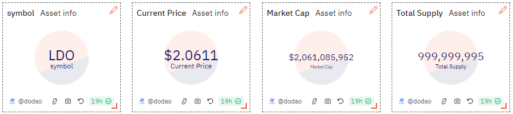

# About

This shows basic info about an asset like its symbol, current price in USD, market cap and total supply to give a quick glance of the asset's current situation in the market.

# Graph



# Relevance

Market cap is crucial for assessing the size, growth, and market share of a token relative to others in the market. Understanding the circulating supply is essential for evaluating the liquidity of a token, which can affect its volatility and price. Asset's current price (in USD) shows asset's worth in the market upon which users usually base their decision of buying the asset and in what quantity.

# Query Explanation

This query gets the token symbol, its market current price in USD, calculates the market capitalization and total supply in the market.

Fetches the latest price and decimal information of the specified token on the specified blockchain from the prices.usd_latest table.

```sql
price AS (
    SELECT
      symbol AS dex_symbol,
      decimals AS dex_decimals,
      price AS dex_price
    FROM
      prices.usd_latest
    WHERE
      contract_address = {{token_address}}
      and blockchain = '{{chain}}'
    ORDER BY
      minute DESC
    LIMIT
      1
  ),
```

Calculates the net supply of the specified token by summing the token balances of all wallets with a positive balance.

```sql
total_supply AS (
    SELECT
      sum(tokens) as net_supply
    FROM
      (
        SELECT
          wallet,
          sum(amount) AS tokens
        FROM
          (
            SELECT
              "to" AS wallet,
              contract_address,
              SUM(cast(value as double)) AS amount
            FROM
              erc20_{{chain}}.evt_Transfer tr
            WHERE
              contract_address = {{token_address}}
            GROUP BY
              1,
              2
            UNION ALL
            SELECT
              "from" AS wallet,
              contract_address,
              - SUM(cast(value as double)) AS amount
            FROM
              erc20_{{chain}}.evt_Transfer tr
            WHERE
              contract_address = {{token_address}}
            GROUP BY
              1,
              2
          ) t
        GROUP BY
          1
      ) a
    WHERE
      tokens > 0
  ),
```

This CTE combines data from the dex_price and total_supply tables, selecting the token symbol, decimals, and price from dex_price, along with the net supply from total_supply.

```sql
aggregated_data AS (
    SELECT
      d.dex_symbol AS symbol,
      d.dex_decimals AS decimals,
      d.dex_price AS price,
      t.net_supply
    FROM
      dex_price d,
      total_supply t
  )
```

Finally calculates the market capitalization and circulating supply of the token. Market cap by multiplying the total amount of tokens by the average token price and circulating supply by converting the raw token amounts from the smallest unit to a readable format by adjusting for decimal places.

```sql
SELECT
  symbol,
  price,
  net_supply / POWER(10, decimals) AS total_supply,
  (net_supply / POWER(10, decimals)) * price AS market_cap
FROM
  aggregated_data;
```

## Tables used

- prices.usd_latest (Curated dataset which contains latest prices table across blockchains. Made by @hildobby and @0xRob)
- tokens.erc20 (Curated dataset for erc20 tokens with addresses, symbols and decimals. Origin unknown)
- erc20\_{{Blockchain}}.evt_Transfer (Curated dataset of erc20 tokens' transactions. Origin unknown)

## Alternative Choices
