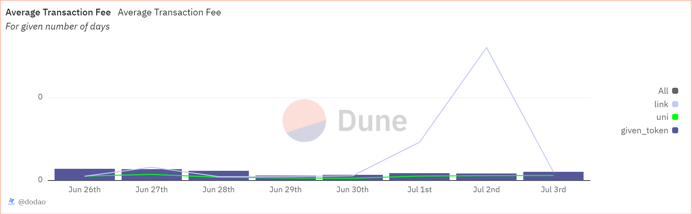

# About

This shows average transaction fee (in ETH) of the token for the past 7 days for transaction cost analysis influencing smart contract execution conditions.

# Graph



# Relevance

- Transaction Cost Analysis: It helps users and developers estimate the cost of using the token for transfers, smart contract interactions, or other operations.
- Network Congestion and Gas Prices: High transaction fees may indicate network congestion, increasing demand for block space, or changes in the network's gas price policies. This analysis helps stakeholders understand network conditions that could affect transaction costs.
- Financial Planning and Operational Costs: For businesses and services that rely on token transfers or smart contract interactions (like DApps, exchanges, wallets), understanding transaction fees is essential for financial planning and managing operational costs.

# Query Explanation

This query calculates the average transaction fee from the transactions of the token for the past 7 days.

Token Details CTE creates a mapping of the token addresses to their corresponding names

```sql
token_details AS (
    SELECT
      {{token_address}} AS token_address,
      'main_token' AS token_name
    UNION ALL
    SELECT
      0x1f9840a85d5aF5bf1D1762F925BDADdC4201F984 AS token_address,
      'uni' AS token_name
    UNION ALL
    SELECT
      0x514910771AF9Ca656af840dff83E8264EcF986CA AS token_address,
      'link' AS token_name
  )
```

Transaction fee CTE compute the transaction fees in ETH for each relevant transaction involving the given token. For each transaction, the fee in ETH is calculated by multiplying the gas_used by gas_price and then dividing by 10^18 to convert from wei to ETH

```sql
transaction_fees AS (
    SELECT
      DATE(evt_block_time) AS day,
      token_name,
      CAST(txs.gas_used AS BIGINT) * CAST(txs.gas_price AS BIGINT) / POWER(10, 18) AS fee_eth
    FROM
      erc20_{{chain}}.evt_Transfer evt
      JOIN {{chain}}.transactions txs ON evt.evt_tx_hash = txs.hash
      JOIN token_details td ON evt.contract_address = td.token_address
    WHERE
      evt_block_time >= CURRENT_DATE - INTERVAL '{{duration_window_days}}' day
  )
```

Average fees CTE computes the average transaction fees per day for each token

```sql
average_fees AS (
    SELECT
      day,
      token_name,
      AVG(fee_eth) AS average_transaction_fee_eth
    FROM
      transaction_fees
    GROUP BY
      day,
      token_name
  )
```

Select finally joins the average transaction fees per day for the main token, UNI, and LINK tokens, ensuring all days are included

```sql
SELECT
  a.day,
  a.average_transaction_fee_eth AS average_transaction_fee_eth_main,
  u.average_transaction_fee_eth AS average_transaction_fee_eth_uni,
  l.average_transaction_fee_eth AS average_transaction_fee_eth_link
FROM
  average_fees a
  LEFT JOIN average_fees u ON a.day = u.day
  AND u.token_name = 'uni'
  LEFT JOIN average_fees l ON a.day = l.day
  AND l.token_name = 'link'
WHERE
  a.token_name = 'main_token'
ORDER BY
  a.day;
```

## Tables used

- erc20\_{{Blockchain}}.evt_Transfer (Curated dataset of erc20 tokens' transactions. Origin unknown)

## Alternative Choices
