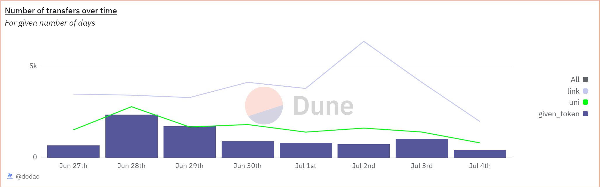

# About

This query aims to compare the daily transfers counts of a specified token against those of UNI and LINK tokens over a specified period. It produces a result showing the transaction counts for each day for the main token, UNI, and LINK tokens.

# Graph



# Relevance

- Transaction Activity Analysis: Understanding the number of transactions helps gauge the activity and popularity of the token.
- Network Usage Insights: High transaction counts can indicate increased usage and demand for the token, potentially reflecting on its market dynamics.
- Comparative Analysis: Comparing the transaction activity with well-known tokens like UNI and LINK provides a benchmark, helping to contextualize the activity level of the main token.

# Query Explanation

This query calculates the number of transfers for the specified token for the past 7 days.

Token Details CTE creates a mapping of the token addresses to their corresponding names

```sql
token_details AS (
    SELECT
      {{token_address}} AS token_address,
      'main_token' AS token_name
    UNION ALL
    SELECT
      0x1f9840a85d5aF5bf1D1762F925BDADdC4201F984 AS token_address,
      'uni' AS token_name
    UNION ALL
    SELECT
      0x514910771AF9Ca656af840dff83E8264EcF986CA AS token_address,
      'link' AS token_name
  )
```

Transaction Counts CTE collects transaction hashes, event block times, and token names for transfer events involving the specified tokens within the given duration

```sql
transaction_counts AS (
    SELECT
      DATE(evt_block_time) AS day,
      token_name,
      evt.evt_tx_hash
    FROM
      erc20_{{chain}}.evt_Transfer evt
      JOIN {{chain}}.transactions txs ON evt.evt_tx_hash = txs.hash
      JOIN token_details td ON evt.contract_address = td.token_address
    WHERE
      evt_block_time >= CURRENT_DATE - INTERVAL '{{duration_window_days}}' day
  )
```

Total Transactions CTE aggregates the transaction counts per day for each token

```sql
total_transactions AS (
    SELECT
      day,
      token_name,
      COUNT(evt_tx_hash) AS transaction_count
    FROM
      transaction_counts
    GROUP BY
      day,
      token_name
  )
```

Joins the daily transaction counts of the main token with those of UNI and LINK, ensuring all days with transactions for the main token are included, and orders the results by the day

```sql
SELECT
  a.day,
  a.transaction_count AS transaction_count_main,
  COALESCE(u.transaction_count, 0) AS transaction_count_uni,
  COALESCE(l.transaction_count, 0) AS transaction_count_link
FROM
  total_transactions a
  LEFT JOIN total_transactions u ON a.day = u.day AND u.token_name = 'uni'
  LEFT JOIN total_transactions l ON a.day = l.day AND l.token_name = 'link'
WHERE
  a.token_name = 'main_token'
ORDER BY
  a.day;
```

## Tables used

- erc20\_{{Blockchain}}.evt_Transfer (Curated dataset of erc20 tokens' transactions. Origin unknown)

**Hardcoded addresses**
- 0x1f9840a85d5aF5bf1D1762F925BDADdC4201F984: This address corresponds to the Uniswap (UNI) token, which is the governance token for the Uniswap decentralized exchange (DEX).
- 0x514910771AF9Ca656af840dff83E8264EcF986CA: This address represents the Chainlink (LINK) token, which is used within the Chainlink decentralized oracle network.

## Alternative Choices
