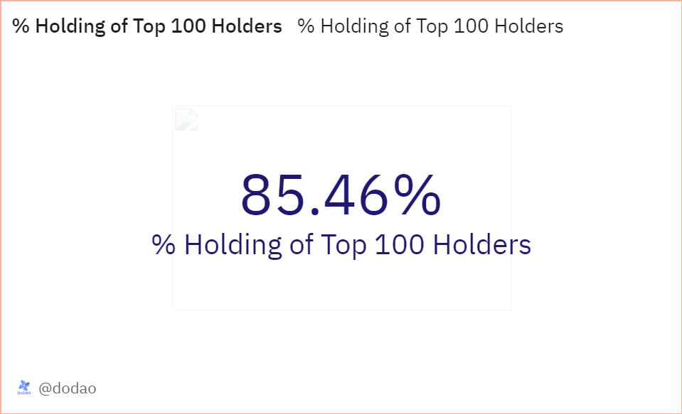

# About

This query calculates the percentage of total token holdings held by the top 100 largest holders of a given token. This analysis provides insights into the degree of decentralization and the concentration of token ownership, highlighting the influence that top stakeholders have within the token's ecosystem.

# Graph



# Relevance

- Market Influence: The top holders often has a significant influence over the token's market dynamics. Large sell-offs or purchases by this holder can lead to substantial price fluctuations.
- Investor Sentiment: Knowledge of a large concentrated holding can affect investor sentiment, as potential investors might be wary of the top holder's control over the token's future movements.
- Decentralization Assessment: A high percentage held by the top 100 holders might indicate centralization, which could deter decentralization purists and affect the blockchain's perceived integrity and resilience against attacks or manipulation.

# Query Explanation

Price CTE calculates the average price of the specified token and retrieves its symbol and decimals

```sql
price AS (
    SELECT
        symbol,
        decimals,
        AVG(token_price_usd) AS price
    FROM
        dex.prices_latest,
        tokens.erc20
    WHERE
        token_address = {{token_address}} AND
        contract_address = {{token_address}} AND
        blockchain = '{{chain}}'
    GROUP BY
        symbol, decimals
)
```

Raw CTE calculates the net amount of tokens held by each address by summing up incoming and outgoing transfers

```sql
raw AS (
    SELECT
        "from" AS address,
        SUM(CAST(value AS DOUBLE) * -1) AS amount
    FROM
        erc20_{{chain}}.evt_Transfer
    WHERE
        contract_address = {{token_address}}
    GROUP BY
        "from"
    UNION ALL
    SELECT
        "to" AS address,
        SUM(CAST(value AS DOUBLE)) AS amount
    FROM
        erc20_{{chain}}.evt_Transfer
    WHERE
        contract_address = {{token_address}}
    GROUP BY
        "to"
)
```

Fund_address CTE creates a list of addresses corresponding to specific funds

```sql
fund_address AS (
    SELECT
        address,
        name
    FROM
        (VALUES
            (0x820fb25352bb0c5e03e07afc1d86252ffd2f0a18, 'Paradigm'),
            (0x0716a17fbaee714f1e6ab0f9d59edbc5f09815c0, 'Jump Trading')
        ) AS t (address, name)
    UNION ALL
    SELECT DISTINCT
        address,
        name
    FROM
        labels.funds
)
```

Labels CTE gets the names and addresses from the labels.all table for our given blockchain and where the category is one of these ('contract', 'social', 'institution', 'hackers', 'infrastructure', 'dao', 'ofac_sanction', 'bridge', 'project wallet', 'Rollup') and union it with the addresses from fund addresses CTE alongwith the exchange addresses and names from the query 2296923.

```sql
labels AS (
    SELECT DISTINCT
        address,
        name
    FROM
        labels.all
    WHERE
        blockchain = '{{chain}}' AND
        category IN ('contract', 'social', 'institution', 'hackers', 'infrastructure', 'dao', 'ofac_sanction', 'bridge', 'project wallet', 'Rollup') AND
        (label_type = 'identifier' OR (label_type = 'persona' AND model_name = 'dao_framework'))
    UNION ALL
    SELECT
        *
    FROM
        fund_address
    UNION ALL
    SELECT
        address,
        exchange AS name
    FROM
        query_2296923
    UNION ALL
    SELECT
        address,
        namespace AS name
    FROM
        {{chain}}.contracts
)
```

Finally get the address with the largest holding among all the addresses including individual, centralized and decentralized exchanges, fund addresses and smart contracts.

```sql
top_100 as (
    SELECT
      a.percent_holdings * 100 AS percent_holdings_counter
    FROM
      (
        SELECT
          address,
          CASE
            WHEN CAST(address as VARBINARY) IN (
              SELECT DISTINCT
                address
              FROM
                labels.cex_ethereum
            )
            OR CAST(address as VARBINARY) IN (
              SELECT DISTINCT
                address
              FROM
                query_2296923
            ) THEN 'CEX'
            WHEN CAST(address as VARBINARY) IN (
              SELECT DISTINCT
                project_contract_address
              FROM
                dex.trades
            ) THEN 'DEX'
            WHEN CAST(address as VARBINARY) IN (
              SELECT DISTINCT
                address
              FROM
                {{chain}}.creation_traces
            )
            AND CAST(address as VARBINARY) NOT IN (
              SELECT DISTINCT
                project_contract_address
              FROM
                dex.trades
            )
            AND CAST(address as VARBINARY) NOT IN (
              SELECT DISTINCT
                address
              FROM
                fund_address
            ) THEN 'Other Smart Contracts'
            WHEN CAST(address as VARBINARY) IN (
              SELECT DISTINCT
                address
              FROM
                fund_address
            ) THEN 'VCs/Fund'
            ELSE 'Individual Address'
          END AS address_type,
          SUM(amount / POWER(10, decimals)) AS amount,
          SUM(amount * price / POWER(10, decimals)) AS value,
          SUM(amount) / (
            SELECT
              SUM(amount)
            FROM
              raw
            WHERE
              address NOT IN (
                '0x0000000000000000000000000000000000000000',
                '0x000000000000000000000000000000000000dEaD'
              )
          ) AS percent_holdings
        FROM
          price,
          raw
        WHERE
          address NOT IN (
            '0x0000000000000000000000000000000000000000',
            '0x000000000000000000000000000000000000dEaD'
          )
        GROUP BY
          address
        ORDER BY
          value DESC
        LIMIT
          100
      ) a
      LEFT JOIN labels b ON CAST(a.address AS VARBINARY) = b.address
    WHERE
      a.value > 1
    GROUP BY
      a.address,
      a.address_type,
      a.amount,
      a.value,
      a.percent_holdings
    ORDER BY
      a.percent_holdings DESC
  )
```

Finally calculates the total percentage of token holdings for the top 100 addresses by summing their individual percentage holdings.

```sql
SELECT
  SUM(percent_holdings_counter) AS total_percent_holdings
FROM
  top_100;
```

## Tables used

- dex.prices_latest (Curated dataset contains token addresses and their USD price. Made by @bernat. Present in the spellbook of dune analytics [Spellbook-Dex-PricesLatest](https://github.com/duneanalytics/spellbook/blob/main/models/dex/dex_prices_latest.sql))
- tokens.erc20 (Curated dataset for erc20 tokens with addresses, symbols and decimals. Origin unknown)
- erc20\_{{Blockchain}}.evt_Transfer (Curated dataset of erc20 tokens' transactions. Origin unknown)
- query_2296923 (returns table with exchange names and their addresses. Uses hardcoded values union with `dune_upload.okx_por_evm` table. [Query-2296923](https://dune.com/queries/2296923))
- dex.trades (Curated dataset contains DEX trade info like taker and maker. Present in spellbook of dune analytics [Spellbook-Dex-Trades](https://github.com/duneanalytics/spellbook/blob/main/models/_sector/dex/trades/dex_trades.sql))
- {{chain}}.contracts (Curated dataset contains abi, code, name, address, etc of the given chain smart contracts. Origin unknown)
- labels.cex_ethereum (Curated dataset contains CEX addresses of ethereum with category, contributor, model name and label type. Present in the spellbook of dune analytics [Spellbook-Labels-CEX-Ethereum](https://github.com/duneanalytics/spellbook/blob/main/models/labels/addresses/institution/identifier/cex/labels_cex_ethereum.sql))
- labels.all (Curated dataset contains labels of known addresses across chains including funds, exchanges, safes, contracts, ens, coins, bridges, dao, pools, etc. Origin unknown)
- {{Blockchain}}.creation_traces (Raw data contains tx hash, address and code.)
- labels.funds (Curated dataset contains labels of known funds addresses across chains. Made by @soispoke. Present in the spellbook of dune analytics [Spellbook-Labels-Funds](https://github.com/duneanalytics/spellbook/blob/main/models/labels/addresses/institution/identifier/funds/labels_funds.sql))

## Alternative Choices
