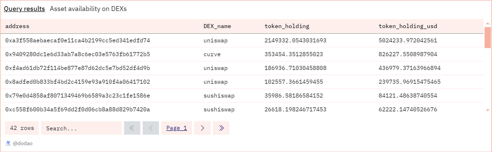

# About

The graph shows participation of different DEXs in the market and the amount of a specified token they hold, along with the USD value of these holdings.

# Graph



# Relevance

This table is relevant for understanding the distribution and adoption of a specified token across different decentralized exchanges (DEXs). By analyzing the holdings of various DEXs, you can gain insights into the token's liquidity, popularity, and market penetration. Here are the key benefits of this query:
- Asset Adoption and Utility: The more DEXs holding significant amounts of the token, the higher its acceptance and utility in the market. This indicates a strong ecosystem and widespread use.
- Market Liquidity: Large token holdings by DEXs suggest active trading and high liquidity, making it easier for users to buy or sell the token without significant price impact.
- Market Penetration: Understanding which DEXs hold the token helps in identifying the token's market penetration. A diverse set of DEXs holding the token implies broad adoption across different platforms.

# Query Explanation

This query calculates the net amount of a specified token held by different DEX addresses on a given blockchain. It aggregates the token transfers to and from DEX addresses and calculates their net holdings and the corresponding USD value.

## All addresses of DEX

This Common Table Expression (CTE) selects the addresses of DEXs from the dex.addresses table and the dex.trades table, casts them to VARCHAR, and assigns them a name.

```sql
WITH
  dex_addresses AS (
    SELECT
      CAST(address as Varchar) AS address,
      dex_name as name
    FROM
      dex.addresses
    WHERE
      blockchain = '{{chain}}'
    GROUP BY
      1,
      2
    UNION ALL
    SELECT
      CAST(project_contract_address as Varchar) AS address,
      project as name
    FROM
      dex.trades
    WHERE
      blockchain = '{{chain}}'
    GROUP BY
      1,
      2
  ),
```

## Price of token 

This CTE calculates the average token price in USD for the specified token on the given blockchain.

```sql
price AS (
    SELECT
      erc.symbol,
      erc.decimals,
      erc.contract_address,
      AVG(dex.token_price_usd) as price
    FROM
      dex.prices_latest dex
      JOIN tokens.erc20 erc ON dex.token_address = erc.contract_address
    WHERE
      erc.contract_address = {{token_address}}
      AND dex.token_address = {{token_address}}
      AND erc.blockchain = '{{chain}}'
    GROUP BY
      erc.symbol,
      erc.decimals,
      erc.contract_address
  ),
```

## Number of tokens transferred in and out

This CTE aggregates token transfers, calculating the total amount sent ("from" addresses) as negative values and the total amount received ("to" addresses) as positive values.

```sql
token_raw AS (
    SELECT
      CAST("from" AS VARCHAR) AS address,
      SUM(CAST(value AS DOUBLE) * -1) AS amount
    FROM
      erc20_{{chain}}.evt_Transfer
    WHERE
      contract_address = {{token_address}}
    GROUP BY
      1
    UNION ALL
    SELECT
      CAST("to" AS VARCHAR) AS address,
      SUM(CAST(value AS DOUBLE)) AS amount
    FROM
      erc20_{{chain}}.evt_Transfer
    WHERE
      contract_address = {{token_address}}
    GROUP BY
      1
  ),
```

## Net Token Holding and their USD price

This CTE calculates the net token holdings and their value in USD.

```sql
token_distribution AS (
    SELECT
      address,
      SUM(amount / POWER(10, decimals)) AS holding,
      SUM(amount * price / POWER(10, decimals)) AS holding_usd
    FROM
      price,
      token_raw
    WHERE
      price.contract_address = {{token_address}}
    GROUP BY
      address
  ),
```

## Net Token Holding and their USD price

This CTE joins the token_distribution CTE with the dex_addresses CTE to get the names of the DEXs and filters out addresses with zero holdings.

```sql
dex_token_holding AS (
    SELECT
      td.address,
      da.name,
      td.holding AS token_holding,
      td.holding_usd AS token_holding_usd
    FROM
      token_distribution td
      JOIN dex_addresses da ON td.address = da.address
    WHERE
      td.holding > 0.0000001
  )
```

## Final Select

This part selects all fields from dex_token_holding and orders the results by token_holding in descending order.

```sql
SELECT
  *
FROM
  dex_token_holding
ORDER BY
  token_holding DESC;
```

## Tables used

- dex.addresses (Curated dataset contains known decentralised exchange addresses. Made by @rantum. Present in the spellbook of dune analytics [Spellbook-CEX](https://github.com/duneanalytics/spellbook/blob/main/models/dex/dex_schema.yml))
- dex.prices_latest (Curated dataset contains token addresses and their USD price. Made by @bernat. Present in the spellbook of dune analytics [Spellbook-Dex-PricesLatest](https://github.com/duneanalytics/spellbook/blob/main/models/dex/dex_prices_latest.sql))
- tokens.erc20 (Curated dataset for erc20 tokens with addresses, symbols and decimals. Origin unknown)
- erc20\_{{Blockchain}}.evt_Transfer (Curated dataset of erc20 tokens' transactions. Origin unknown)
- dex.trades (Curated dataset contains DEX trade info like taker and maker. Present in spellbook of dune analytics [Spellbook-Dex-Trades](https://github.com/duneanalytics/spellbook/blob/main/models/_sector/dex/trades/dex_trades.sql))