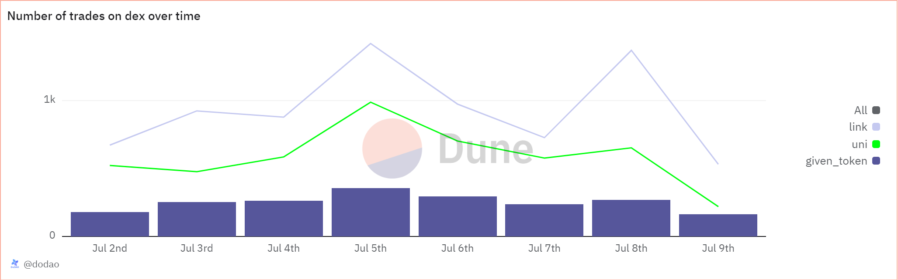
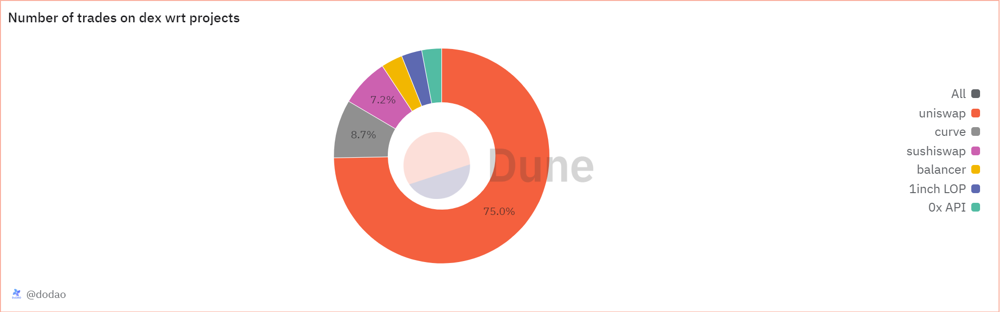

# About

The daily trade counts query retrieves and aggregates the number of trades involving a specific token across multiple tokens (including UNI and LINK) over a defined period. It groups these trades by day, providing insights into the daily transactional activity for each token within the specified timeframe.
The top projects by trade count query identifies and counts the number of trades involving a specified token grouped by project.

# Graph




# Relevance

These queries are essential for understanding the trading dynamics of popular tokens on decentralized exchanges. 

The query allows users to compare the trading volume of the specified token with Uniswap (UNI) and Chainlink (LINK) over the same timeframe. This comparison can reveal if the token has more or less trading activity compared to established tokens.
By looking at daily trade counts (day) over a set period, users can potentially identify trends in trading activity. This might indicate increased interest or a decline in the token.

Identifying the top projects by trade count provides valuable insights into the most active platforms and projects interacting with a given token. This data is essential for evaluating the token's adoption, market reach, and potential partnerships or collaborations.

# Query Explanation

## number of trades on dex over time

This query aggregates trade counts for three specific tokens (a given token, UNI, and LINK) over the past specified number of days.

Aggregates daily trade counts for the given token

```sql
WITH
  given_token_trades AS (
    SELECT
      DATE_TRUNC('day', block_time) AS day,
      COUNT(*) AS given_token_trade_count
    FROM
      dex.trades
    WHERE
      (
        token_bought_address = {{token_address}}
        OR token_sold_address = {{token_address}}
      )
      AND block_time >= CURRENT_DATE - INTERVAL '{{duration_window_days}}' day
    GROUP BY
      1
  ),
```

Joins the three CTEs on the day field using a full outer join to include all days, even if some tokens have no trades on a given day

```sql
SELECT
  COALESCE(gt.day, ut.day, lt.day) AS day,
  COALESCE(gt.given_token_trade_count, 0) AS given_token_trades,
  COALESCE(ut.uni_trade_count, 0) AS uni_token_trades,
  COALESCE(lt.link_trade_count, 0) AS link_token_trades
FROM
  given_token_trades gt
  FULL OUTER JOIN uni_token_trades ut ON gt.day = ut.day
  FULL OUTER JOIN link_token_trades lt ON gt.day = lt.day
  OR ut.day = lt.day
ORDER BY
  day;
```

### Tables used

- dex.trades (Curated dataset contains DEX trade info like taker and maker. Present in spellbook of dune analytics Spellbook-Dex-Trades)

## number of trades on dex wrt projects

The second query aggregates and limits the top projects involved in trades of a specific token over the past specified number of days.

Counts trades involving a given token, grouped by project, within a defined time window. Results are ordered by trade count in descending order and limited to the top 6 projects.

```sql
select
  count(*) as trade_count,
  project
from
  dex.trades
where
  (
    token_bought_address = {{token_address}}
    or token_sold_address = {{token_address}}
  )
  AND block_time >= CURRENT_DATE - INTERVAL '{{duration_window_days}}' day
group by
  project
ORDER BY
  trade_count DESC
LIMIT
  6
```

### Tables used

- dex.trades (Curated dataset contains DEX trade info like taker and maker. Present in spellbook of dune analytics Spellbook-Dex-Trades)

### Alternative Choices
