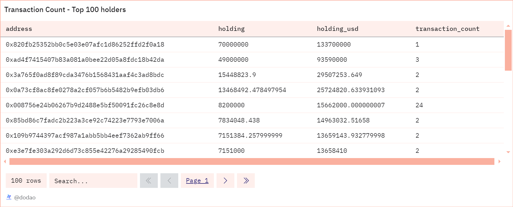

# About

This query calculates the total transaction count for the top 100 holders of the given token. It calculates the total number of transactions for each holder, providing insights into how actively these key stakeholders are engaging in trading or transferring the token. This kind of analysis helps in identifying not only the major holders by balance but also those who are most active in the market.

# Graph



# Relevance

- Market Activity and Liquidity: Higher transaction counts from major holders can indicate robust trading activity and contribute to greater liquidity in the market.
- Holder Engagement and Market Influence: Active trading by major holders can significantly influence market prices and trends, especially in smaller or less liquid markets.

# Query Explanation

This query calculates the top 100 token holders by their token holdings, including their token values in USD. It also computes the total transaction count of these holders and joins this data for a comprehensive view of the top token holders and their activities.

Price CTE calculates the price of the specified token and retrieves its symbol and decimals

```sql
price AS (
    SELECT
      symbol,
      decimals,
      price
    FROM
      prices.usd_latest
    WHERE
      contract_address = {{token_address}}
      AND blockchain = '{{chain}}'
    ORDER BY
      minute DESC
    LIMIT
      1
  )
```

Raw CTE calculates the net amount of tokens held by each address by summing up incoming and outgoing transfers

```sql
raw AS (
    SELECT
      CAST("from" AS VARCHAR) AS address,
      SUM(CAST(value AS DOUBLE) * -1) AS amount
    FROM
      erc20_{{chain}}.evt_Transfer
    WHERE
      contract_address = {{token_address}}
    GROUP BY
      1
    UNION ALL
    SELECT
      CAST("to" AS VARCHAR) AS address,
      SUM(CAST(value AS DOUBLE)) AS amount
    FROM
      erc20_{{chain}}.evt_Transfer
    WHERE
      contract_address = {{token_address}}
    GROUP BY
      1
  )
```

Distribution CTE calculates the total token holdings and their USD value for each address by summing up the token amounts and multiplying by their price, grouping the results by address.

```sql
distribution AS (
    SELECT
      address,
      SUM(amount / POWER(10, decimals)) AS holding,
      SUM(amount * price / POWER(10, decimals)) AS holding_usd,
    FROM
      price,
      raw
    GROUP BY
      address
  )
```

top_100_holders CTE selects the top 100 holders of a token, excluding certain addresses such as centralized exchanges, Dex addresses, project contracts, and null or dead addresses, and ensures they are not associated with specific projects unless they are Gnosis Safe contracts. It orders the results by the amount of holdings in descending order.

```sql
top_100_holders AS (
    SELECT
      d.address,
      d.holding,
      d.holding_usd
    FROM
      distribution d
      LEFT JOIN contracts.contract_mapping c ON address = c.contract_address
    where
      address not in (
        select distinct
          address
        from
          labels.cex_ethereum
        union all
        select distinct
          project_contract_address
        from
          dex.trades
      )
      and address not in (
        0x0000000000000000000000000000000000000000,
        0x000000000000000000000000000000000000dEaD
      )
      AND (
        c.contract_address IS NULL
        OR c.contract_project = 'Gnosis Safe'
      )
    ORDER BY
      d.holding DESC
    LIMIT
      100
  )
```

Transaction count CTE calculates the number of transactions for each address.

```sql
transaction_counts AS (
    SELECT
      address,
      COUNT(*) AS transaction_count
    FROM
      (
        SELECT
          CAST("from" AS VARCHAR) AS address
        FROM
          erc20_{{chain}}.evt_Transfer
        WHERE
          contract_address = {{token_address}}
        UNION ALL
        SELECT
          CAST("to" AS VARCHAR) AS address
        FROM
          erc20_{{chain}}.evt_Transfer
        WHERE
          contract_address = {{token_address}}
      ) tx
    GROUP BY
      address
  )
```

Finally shows the addresses, their token holdings in both tokens and USD, and their transaction count, ordered by transaction count.

```sql
SELECT
  t.address,
  t.holding,
  t.holding_usd,
  COALESCE(tc.transaction_count, 0) AS transaction_count
FROM
  top_100_holders t
  LEFT JOIN transaction_counts tc ON t.address = tc.address
ORDER BY
  transaction_count DESC;
```

## Tables used

- dex.prices_latest (Curated dataset contains token addresses and their USD price. Made by @bernat. Present in the spellbook of dune analytics [Spellbook-Dex-PricesLatest](https://github.com/duneanalytics/spellbook/blob/main/models/dex/dex_prices_latest.sql))
- tokens.erc20 (Curated dataset for erc20 tokens with addresses, symbols and decimals. Origin unknown)
- erc20\_{{Blockchain}}.evt_Transfer (Curated dataset of erc20 tokens' transactions. Origin unknown)

## Alternative Choices
