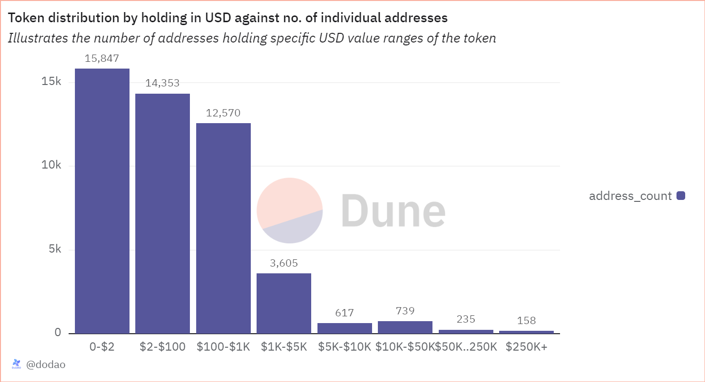

# About

The graph shows number of individual addresses that falls in each defined range (0 - $100, $100 - $1000, $1000 - $5,000, $5000 - $10,000, $10,000 - $50,000 , $50,000 - $250,000 , 250,000+). These ranges show USD total of the holdings for an address.

# Graph



# Relevance

This graph is relevant to understand the distribution of a token among different categories. It helps to understand the extent of decentralization of the asset in the market and assess the risk associated with outliers of the higher range.

- Decentralization: Knowing how many addresses hold small vs. large amounts of the token can indicate the level of decentralization. A more decentralized distribution suggests a healthier, more stable network as it is less likely to be influenced or manipulated by a few large holders.
- Associated Risk: Analyzing the distribution helps in assessing the risk associated with large holders. If a significant portion of the supply is held by a small number of addresses (large holders), there is a higher risk of market manipulation or large-scale sell-offs that can affect the token's price stability.
- Market Sentiment: A higher number of addresses holding smaller amounts may indicate widespread small-scale investment and adoption, reflecting broader market confidence. Conversely, fewer addresses with larger holdings may indicate concentrated investment by a few entities, which could be either a positive sign of strong backing or a potential risk of market control.

# Query Explanation

This query categorizes addresses based on their token holdings in USD into different ranges and count the number of distinct addresses within each range.

Price CTE calculates the average price of the specified token and retrieves its symbol and decimals

```sql
price AS (
    SELECT
        symbol,
        decimals,
        AVG(token_price_usd) AS price
    FROM
        dex.prices_latest
    JOIN tokens.erc20 ON contract_address = {{token_address}}
    WHERE
        token_address = {{token_address}}
        AND blockchain = '{{chain}}'
    GROUP BY
        symbol,
        decimals
)
```

Raw CTE calculates the net amount of tokens held by each address by summing up incoming and outgoing transfers

```sql
raw AS (
    SELECT
        "from" AS address,
        SUM(CAST(value AS DOUBLE) * -1) AS amount
    FROM
        erc20_{{chain}}.evt_Transfer
    WHERE
        contract_address = {{token_address}}
    GROUP BY
        "from"
    UNION ALL
    SELECT
        "to" AS address,
        SUM(CAST(value AS DOUBLE)) AS amount
    FROM
        erc20_{{chain}}.evt_Transfer
    WHERE
        contract_address = {{token_address}}
    GROUP BY
        "to"
)
```

Holdings CTE calculates the holdings in USD for each address excluding the burner addresses.

```sql
holdings AS (
    SELECT
        address,
        SUM(amount / POWER(10, decimals)) AS holding,
        SUM(amount * price / POWER(10, decimals)) AS holding_usd
    FROM
        price,
        raw
    WHERE
        address NOT IN (
            0x0000000000000000000000000000000000000000,
            0x000000000000000000000000000000000000dEaD
        )
    GROUP BY
        address,
        decimals,
        price
)
```

The dex_cex_addresses CTE combines addresses from CEX and DEX tables for a specified blockchain into a single list.

```sql
dex_cex_addresses AS (
    SELECT
      address AS address
    FROM
      cex.addresses
    WHERE
      blockchain = '{{chain}}'
    UNION ALL
    SELECT
      address
    FROM
      (
        SELECT
          address AS address
        FROM
          dex.addresses
        WHERE
          blockchain = '{{chain}}'
        GROUP BY
          1
        UNION ALL
        SELECT
          project_contract_address AS address
        FROM
          dex.trades
        WHERE
          blockchain = '{{chain}}'
        GROUP BY
          1
      )
  ),
```

Categorized holdings CTE categorizes the holdings into defined ranges, where holding is greater than 0. It uses a `CASE` statement to assign a category to each address based on their total holding value in USD excluding specific addresses and DEX/CEX addresses, and filtering for non-zero holdings.

```sql
categorized_holdings AS (
    SELECT
        address,
        holding,
        holding_usd,
        CASE
            WHEN holding_usd BETWEEN 0 AND 100 THEN '0-$100'
            WHEN holding_usd > 100 AND holding_usd <= 1000 THEN '$100-$1K'
            WHEN holding_usd > 1000 AND holding_usd <= 5000 THEN '$1K-$5K'
            WHEN holding_usd > 5000 AND holding_usd <= 10000 THEN '$5K-$10K'
            WHEN holding_usd > 10000 AND holding_usd <= 50000 THEN '$10K-$50K'
            WHEN holding_usd > 50000 AND holding_usd <= 250000 THEN '$50K-$250K'
            WHEN holding_usd > 250000 THEN '$250K+'
        END AS holding_category
    FROM
        holdings
        LEFT JOIN contracts.contract_mapping c ON address = c.contract_address
    WHERE
        address NOT IN (
            0x0000000000000000000000000000000000000000,
            0x000000000000000000000000000000000000dEaD
          )
          AND (
            c.contract_address IS NULL
            OR c.contract_project = 'Gnosis Safe'
          ) AND address NOT IN (select distinct
          address
        from
          dex_cex_addresses) AND
        holding_usd > 0
)
```

Finally selects the holding categories and counts the number of distinct addresses within each category.

```sql
SELECT
    holding_category,
    COUNT(DISTINCT address) AS address_count
FROM
    categorized_holdings
GROUP BY
    holding_category
ORDER BY
    (CASE
        WHEN holding_category = '0-$100' THEN 1
        WHEN holding_category = '$100-$1K' THEN 2
        WHEN holding_category = '$1K-$5K' THEN 3
        WHEN holding_category = '$5K-$10K' THEN 4
        WHEN holding_category = '$10K-$50K' THEN 5
        WHEN holding_category = '$50K-$250K' THEN 6
        WHEN holding_category = '$250K+' THEN 7
    END);
```

**Hardcoded addresses**

- [0x0000000000000000000000000000000000000000](https://etherscan.io/address/0x0000000000000000000000000000000000000000): This address is not owned by any user, is often associated with token burn & mint/genesis events and used as a generic null address
- [0x000000000000000000000000000000000000dEaD](https://etherscan.io/address/0x000000000000000000000000000000000000dEaD): This address is commonly used by projects to burn tokens (reducing total supply).

## Tables used

- dex.prices_latest (Curated dataset contains token addresses and their USD price. Made by @bernat. Present in the spellbook of dune analytics [Spellbook-Dex-PricesLatest](https://github.com/duneanalytics/spellbook/blob/main/models/dex/dex_prices_latest.sql))
- tokens.erc20 (Curated dataset for erc20 tokens with addresses, symbols and decimals. Origin unknown)
- erc20\_{{Blockchain}}.evt_Transfer (Curated dataset of erc20 tokens' transactions. Origin unknown)

## Alternative Choices
