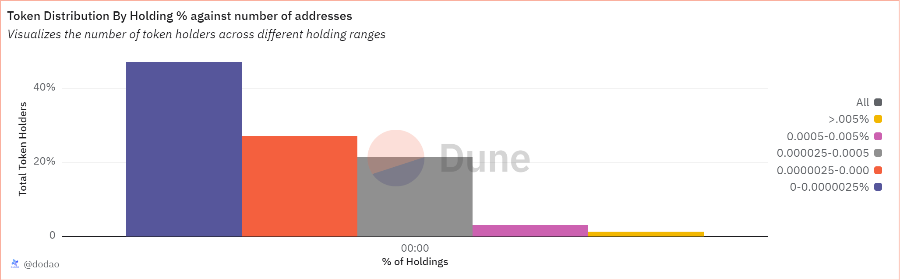

# About

This graph shows how the total supply of a token is distributed among the token holders

# Graph



# Relevance

## Asset decentralization

Token distribution by holding % tells us how decentralized or centeralized the asset is. A more decentralized distribution, in which large number of addresses hold smaller percentages of the total supply, suggests a good ecosystem. On the other hand, a distribution, where a few addresses hold large portions of the supply, indicates market manipulation, liquidity issues or governance issues

## Holder Categories

- Investors: addresses holding less than 0.1% of the total supply represent retail investors. A large number of such addresses indicate broad adoption and support.
- Whales: Addresses holding more than 1% of the total supply are considered whales. Monitoring whale activity can provide insights into potential market movements or strategic investments.
- Institutional Investors: Addresses holding significant but not excessively large percentages (e.g., >.5%) might represent institutional investors or large stakeholders.

# Query Explanation

This query calculates the distribution of token holdings by categorizing addresses into various percentage ranges. It considers the price and decimals of the token, sums the incoming and outgoing transfers to determine net holdings. The query then categorizes these holdings into ranges, counts the number of addresses in each range, and sums the total holdings for each range.

Retrieves the number of decimals for the specified token.

```sql
decimals_info_token AS (
    SELECT
      decimals
    FROM
      tokens.erc20
    WHERE
      contract_address = {{token_address}}
  )
```

Computes the total supply of the token by summing up all transfer values.

```sql
token_total_supply AS (
    SELECT
      sum(tokens / POWER(10, d.decimals)) as total_supply
    FROM
      (
        SELECT
          wallet,
          sum(amount) AS tokens
        FROM
          (
            SELECT
              "to" AS wallet,
              contract_address,
              SUM(cast(value as double)) AS amount
            FROM
              erc20_{{chain}}.evt_Transfer tr
            WHERE
              contract_address = {{token_address}}
            GROUP BY
              1,
              2
            UNION ALL
            SELECT
              "from" AS wallet,
              contract_address,
              - SUM(cast(value as double)) AS amount
            FROM
              erc20_{{chain}}.evt_Transfer tr
            WHERE
              contract_address = {{token_address}}
            GROUP BY
              1,
              2
          ) t
        GROUP BY
          1
      ) a
      CROSS JOIN decimals_info_token d
    WHERE
      tokens > 0
  ),
```

This CTE selects transfer events for the specified token, excluding self-transfers.

```sql
transfers AS (
    SELECT
      DATE_TRUNC('day', evt_block_time) AS DAY,
      contract_address,
      "from",
      to,
      value
    FROM
      erc20_{{chain}}.evt_Transfer
    WHERE
      contract_address = {{token_address}}
      AND "from" <> to
  ),
```

This CTE calculates daily balances for each address by summing up incoming (to address) and outgoing (from address) token values.

```sql
balances AS (
    SELECT
      DAY,
      contract_address,
      to AS address,
      SUM(value) AS balance
    FROM
      transfers
    GROUP BY
      DAY,
      contract_address,
      to
    UNION ALL
    SELECT
      DAY,
      contract_address,
      "from" AS address,
      - SUM(value) AS balance
    FROM
      transfers
    GROUP BY
      DAY,
      contract_address,
      "from"
  ),
```

Calculates the running balance for each address over time.

```sql
token_balances_with_gap_days AS (
    SELECT
      t.day,
      address,
      SUM(balance) OVER (
        PARTITION BY
          address
        ORDER BY
          t.day
      ) AS balance,
      LEAD(DAY, 1, CURRENT_TIMESTAMP) OVER (
        PARTITION BY
          address
        ORDER BY
          t.day
      ) AS next_day
    FROM
      balances AS t
  ),
```

Generates a sequence of days for the current date.

```sql
days AS (
    SELECT
      DAY
    FROM
      UNNEST (
        SEQUENCE(
          TRY_CAST(DATE_TRUNC('day', CURRENT_TIMESTAMP) AS TIMESTAMP),
          CAST(
            TRY_CAST(
              TRY_CAST(
                TRY_CAST(DATE_TRUNC('day', CURRENT_TIMESTAMP) AS TIMESTAMP) AS TIMESTAMP
              ) AS TIMESTAMP
            ) AS TIMESTAMP
          ),
          INTERVAL '1' day
        )
      ) AS _u (DAY)
  )
```

Computes the balance for each address for each day, filling in the days between transfers.

```sql
token_balance_all_days AS (
    SELECT
      d.day,
      address,
      SUM(
        balance / TRY_CAST(POWER(10, di.decimals) AS DOUBLE)
      ) AS balance
    FROM
      token_balances_with_gap_days AS b
      INNER JOIN days AS d ON b.day <= d.day
      AND d.day < b.next_day
      CROSS JOIN decimals_info_token di
    GROUP BY
      1,
      2
    ORDER BY
      1,
      2
  )
```

Groups token holders into different categories based on the percentage of the total supply they hold and calculates the number of addresses within each range for each day.

```sql
token_holders_with_token_value AS (
    SELECT
      b.day AS "Date",
      COUNT(
        CASE
          WHEN b.balance > 0
          AND b.balance <= ts.total_supply * 0.000000025 THEN b.address
        END
      ) AS "0-0.0000025%",
      COUNT(
        CASE
          WHEN b.balance > ts.total_supply * 0.000000025
          AND b.balance <= ts.total_supply * 0.00000025 THEN b.address
        END
      ) AS "0.0000025-0.000025%",
      COUNT(
        CASE
          WHEN b.balance > ts.total_supply * 0.00000025
          AND b.balance <= ts.total_supply * 0.000005 THEN b.address
        END
      ) AS "0.000025-0.0005%",
      COUNT(
        CASE
          WHEN b.balance > ts.total_supply * 0.000005 
          AND b.balance <= ts.total_supply * 0.00005 THEN b.address
        END
      ) AS "0.0005-0.005%",
      COUNT(
        CASE
          WHEN b.balance > ts.total_supply * 0.00005 THEN b.address
        END
      ) AS ">.005%"
    FROM
      token_balance_all_days AS b
      CROSS JOIN token_total_supply ts
    WHERE
      balance > 0
    GROUP BY
      b.day,
      ts.total_supply
  )
```

The final SELECT statement retrieves the date and counts of token holders for each range of the total supply.

```sql
SELECT
  htv_token."Date" AS "Date",
  COALESCE(htv_token."0-0.0000025%", 0) AS "0-0.0000025%",
  COALESCE(htv_token."0.0000025-0.000025%", 0) AS "0.0000025-0.000025%",
  COALESCE(htv_token."0.000025-0.0005%", 0) AS "0.000025-0.0005%",
  COALESCE(htv_token."0.0005-0.005%", 0) AS "0.0005-0.005%",
  COALESCE(htv_token.">.005%", 0) AS ">.005%"
FROM
  token_holders_with_token_value htv_token
ORDER BY
  htv_token."Date";
```

## Tables used

- tokens.erc20 (Curated dataset for erc20 tokens with addresses, symbols and decimals. Origin unknown)
- erc20\_{{Blockchain}}.evt_Transfer (Curated dataset of erc20 tokens' transactions. Origin unknown)

## Alternative Choices


