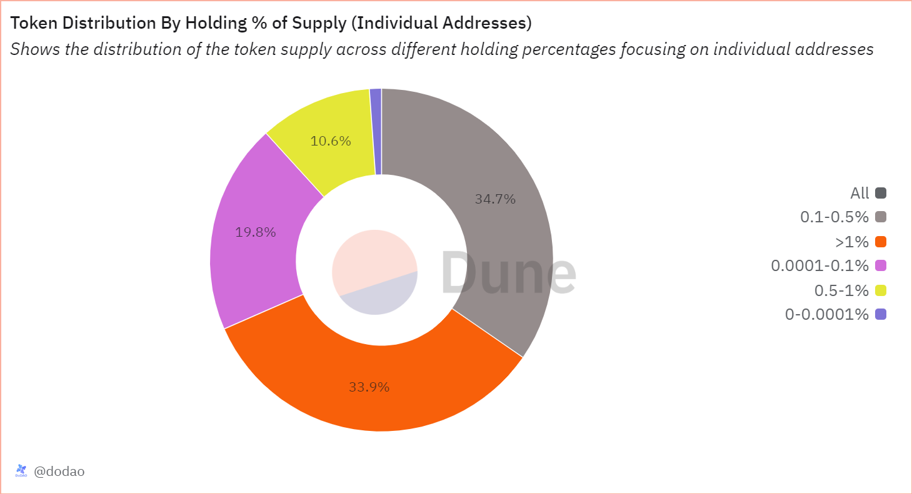

# About

This pie chart visualizes the distribution of token balances among holders based on predefined percentage ranges relative to the token's total supply. Each range (0-0.0001%, 0.0001-0.1%, 0.1-0.5%, 0.5-1%, >1%) represents a segment of holders by their token holdings, illustrating how the total supply is distributed across different holder categories.

# Graph



# Relevance

## Asset decentralization

It reveals the distribution of token holdings across a spectrum, indicating whether the token supply is concentrated among a few large holders or distributed more evenly among many small holders. A more decentralized distribution typically suggests a broader ownership base and potentially greater network resilience.

## Holder Categories

It categorizes holders based on their token balances, such as distinguishing between smaller retail holders (0-0.0001%, 0.0001-0.1%) and larger entities (0.1-0.5%, 0.5-1%, >1%). This categorization helps identify the proportion of tokens held by different types of entities, including retail investors, institutions, whales and possibly exchanges.

# Query Explanation

This query calculates the total token balances distributed across predefined percentage ranges (range) relative to the token's total supply. It first computes daily balances adjusted for token decimals and aggregates these into cumulative balances over time. Then, it categorizes these balances into specified percentage brackets (e.g., 0-0.0001%, 0.0001-0.1%, etc.) based on the token's total supply, ensuring non-null values are displayed in ascending order by range.

Retrieves the number of decimals for the specified token.

```sql
decimals_info_token AS (
    SELECT
      decimals
    FROM
      tokens.erc20
    WHERE
      contract_address = {{token_address}}
  )
```

Calculates the total supply of the token by summing up the balances of all wallets, adjusting for the token's decimal places. It aggregates the positive and negative token transfers to derive the net balance per wallet.

```sql
token_total_supply AS (
    SELECT
      SUM(tokens / POWER(10, d.decimals)) AS total_supply
    FROM
      (
        SELECT
          wallet,
          SUM(amount) AS tokens
        FROM
          (
            SELECT
              "to" AS wallet,
              contract_address,
              SUM(CAST(value AS DOUBLE)) AS amount
            FROM
              erc20_{{chain}}.evt_Transfer tr
            WHERE
              contract_address = {{token_address}}
            GROUP BY
              1,
              2
            UNION ALL
            SELECT
              "from" AS wallet,
              contract_address,
              - SUM(CAST(value AS DOUBLE)) AS amount
            FROM
              erc20_{{chain}}.evt_Transfer tr
            WHERE
              contract_address = {{token_address}}
            GROUP BY
              1,
              2
          ) t
        GROUP BY
          1
      ) a
      CROSS JOIN decimals_info_token d
    WHERE
      tokens > 0
  ),
```

Computes the balance of each wallet by summing up the net token transfers (both incoming and outgoing) and adjusts for the token's decimals. This results in a list of wallets and their respective token balances.

```sql
wallet_balances AS (
    SELECT
      wallet,
      tokens / POWER(10, d.decimals) AS balance
    FROM
      (
        SELECT
          wallet,
          SUM(amount) AS tokens
        FROM
          (
            SELECT
              "to" AS wallet,
              contract_address,
              SUM(CAST(value AS DOUBLE)) AS amount
            FROM
              erc20_{{chain}}.evt_Transfer tr
            WHERE
              contract_address = {{token_address}}
            GROUP BY
              1,
              2
            UNION ALL
            SELECT
              "from" AS wallet,
              contract_address,
              - SUM(CAST(value AS DOUBLE)) AS amount
            FROM
              erc20_{{chain}}.evt_Transfer tr
            WHERE
              contract_address = {{token_address}}
            GROUP BY
              1,
              2
          ) t
        GROUP BY
          1
      ) a
      CROSS JOIN decimals_info_token d
    WHERE
      tokens > 0
  )
```

This CTE combines all unique addresses from centralized exchange (CEX) and decentralized exchange (DEX) sources for the specified blockchain.

```sql
dex_cex_addresses AS (
    SELECT
      address AS address
    FROM
      cex.addresses
    WHERE
      blockchain = '{{chain}}'
    UNION ALL
    SELECT
      address
    FROM
      (
        SELECT
          address AS address
        FROM
          dex.addresses
        WHERE
          blockchain = '{{chain}}'
        GROUP BY
          1
        UNION ALL
        SELECT
          project_contract_address AS address
        FROM
          dex.trades
        WHERE
          blockchain = '{{chain}}'
        GROUP BY
          1
      )
  )
```

The query categorizes token balances into specified percentage ranges of the total supply, excluding certain addresses, and calculates the total balance for each range.

```sql
SELECT
  range,
  COALESCE(SUM(balance), 0) AS balance
FROM
  (
    SELECT
      CASE
        WHEN wb.balance > 0
        AND wb.balance <= ts.total_supply * 0.000001 THEN '0-0.0001%'
        WHEN wb.balance > ts.total_supply * 0.000001
        AND wb.balance <= ts.total_supply * 0.001 THEN '0.0001-0.1%'
        WHEN wb.balance > ts.total_supply * 0.001
        AND wb.balance <= ts.total_supply * 0.005 THEN '0.1-0.5%'
        WHEN wb.balance > ts.total_supply * 0.005
        AND wb.balance <= ts.total_supply * 0.01 THEN '0.5-1%'
        WHEN wb.balance > ts.total_supply * 0.01 THEN '>1%'
      END AS range,
      wb.balance
    FROM
      wallet_balances wb
      LEFT JOIN contracts.contract_mapping c ON wallet = c.contract_address
      CROSS JOIN token_total_supply ts
    WHERE
      wallet NOT IN (
        0x0000000000000000000000000000000000000000,
        0x000000000000000000000000000000000000dEaD
      )
      AND (
        c.contract_address IS NULL
        OR c.contract_project = 'Gnosis Safe'
      )
      AND wallet not in (
        select distinct
          address
        from
          dex_cex_addresses
      )
  ) grouped_balances
GROUP BY
  range
ORDER BY
  range;
```

## Tables used

- tokens.erc20 (Curated dataset for erc20 tokens with addresses, symbols and decimals. Origin unknown)
- erc20\_{{Blockchain}}.evt_Transfer (Curated dataset of erc20 tokens' transactions. Origin unknown)

## Alternative Choices


