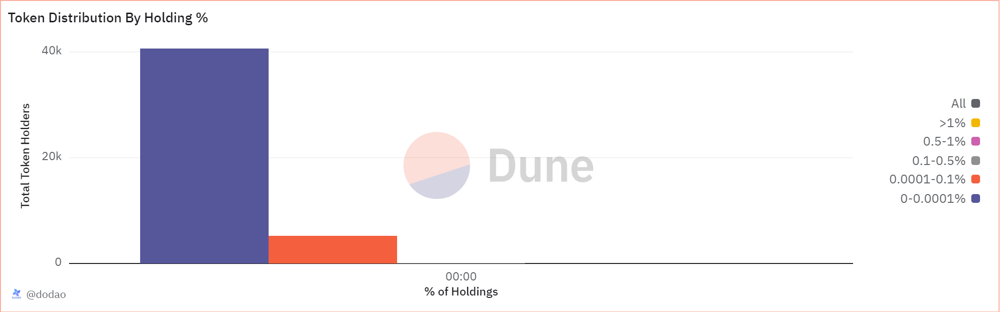

# About

This graph shows how the total supply of a token is distributed among the token holders

# Graph



# Relevance

## Asset decentralization

Token distribution by holding % tells us how decentralized or centeralized the asset is. A more decentralized distribution, in which large number of addresses hold smaller percentages of the total supply, suggests a good ecosystem. On the other hand, a distribution, where a few addresses hold large portions of the supply, indicates market manipulation, liquidity issues or governance issues

## Holder Categories

- Investors: addresses holding less than 0.1% of the total supply represent retail investors. A large number of such addresses indicate broad adoption and support.
- Whales: Addresses holding more than 1% of the total supply are considered whales. Monitoring whale activity can provide insights into potential market movements or strategic investments.
- Institutional Investors: Addresses holding significant but not excessively large percentages (e.g., >1%) might represent institutional investors or large stakeholders.

# Query Explanation

This query calculates the distribution of token holdings by categorizing addresses into various percentage ranges. It considers the price and decimals of the token, sums the incoming and outgoing transfers to determine net holdings. The query then categorizes these holdings into ranges, counts the number of addresses in each range, and sums the total holdings for each range.

Retrieves the number of decimals for the specified token.

```sql
decimals_info_token AS (
    SELECT
      decimals
    FROM
      tokens.erc20
    WHERE
      contract_address = {{token_address}}
  )
```

Calculates the value of token transfers by normalizing them using the token's decimals. Includes both minting (transfers from the zero address) and burning (transfers to the zero address) events.

```sql
value_transfers_token AS (
    SELECT
      b.value / POWER(10, d.decimals) AS value
    FROM
      erc20_{{chain}}.evt_Transfer AS b
      INNER JOIN {{chain}}.transactions AS tx ON tx.hash = b.evt_tx_hash
      CROSS JOIN decimals_info_token d
    WHERE
      b.contract_address = {{token_address}}
      AND b."from" = 0x0000000000000000000000000000000000000000
    UNION ALL
    SELECT
      - d.value / POWER(10, e.decimals) AS value
    FROM
      erc20_{{chain}}.evt_Transfer AS d
      INNER JOIN {{chain}}.transactions AS tx ON tx.hash = d.evt_tx_hash
      CROSS JOIN decimals_info_token e
    WHERE
      d.contract_address = {{token_address}}
      AND d."to" = 0x0000000000000000000000000000000000000000
  )
```

Computes the total supply of the token by summing up all normalized transfer values.

```sql
token_total_supply AS (
    SELECT
      SUM(value) AS total_supply
    FROM
      value_transfers_token
  )
```

Aggregates daily token transfers, summing the amounts for each address and day.

```sql
token_transfers AS (
    SELECT
      DAY,
      address,
      token_address,
      SUM(amount) AS amount
    FROM
      (
        SELECT
          DATE_TRUNC('day', evt_block_time) AS DAY,
          "to" AS address,
          tr.contract_address AS token_address,
          CAST(value AS DECIMAL (38, 0)) AS amount
        FROM
          erc20_{{chain}}.evt_Transfer AS tr
        WHERE
          contract_address = {{token_address}}
        UNION ALL
        SELECT
          DATE_TRUNC('day', evt_block_time) AS DAY,
          "from" AS address,
          tr.contract_address AS token_address,
          (-1) * (CAST(value AS DECIMAL (38, 0))) AS amount
        FROM
          erc20_{{chain}}.evt_Transfer AS tr
        WHERE
          contract_address = {{token_address}}
      ) AS t
    GROUP BY
      1,
      2,
      3
  )
```

Calculates the running balance for each address over time.

```sql
token_balances_with_gap_days AS (
    SELECT
      t.day,
      address,
      SUM(amount) OVER (
        PARTITION BY
          address
        ORDER BY
          t.day
      ) AS balance,
      LEAD(DAY, 1, CURRENT_TIMESTAMP) OVER (
        PARTITION BY
          address
        ORDER BY
          t.day
      ) AS next_day
    FROM
      token_transfers AS t
  )
```

Generates a sequence of days for the current date.

```sql
days AS (
    SELECT
      DAY
    FROM
      UNNEST (
        SEQUENCE(
          TRY_CAST(DATE_TRUNC('day', CURRENT_TIMESTAMP) AS TIMESTAMP),
          CAST(
            TRY_CAST(
              TRY_CAST(
                TRY_CAST(DATE_TRUNC('day', CURRENT_TIMESTAMP) AS TIMESTAMP) AS TIMESTAMP
              ) AS TIMESTAMP
            ) AS TIMESTAMP
          ),
          INTERVAL '1' day
        )
      ) AS _u (DAY)
  )
```

Computes the balance for each address for each day, filling in the days between transfers.

```sql
token_balance_all_days AS (
    SELECT
      d.day,
      address,
      SUM(
        balance / TRY_CAST(POWER(10, di.decimals) AS DOUBLE)
      ) AS balance
    FROM
      token_balances_with_gap_days AS b
      INNER JOIN days AS d ON b.day <= d.day
      AND d.day < b.next_day
      CROSS JOIN decimals_info_token di
    GROUP BY
      1,
      2
    ORDER BY
      1,
      2
  )
```

Groups token holders into different categories based on the percentage of the total supply they hold and calculates the number of addresses within each range for each day.

```sql
token_holders_with_token_value AS (
    SELECT
      b.day AS "Date",
      COUNT(
        CASE
          WHEN b.balance > 0
          AND b.balance <= ts.total_supply * 0.000001 THEN b.address
        END
      ) AS "0-0.0001%",
      COUNT(
        CASE
          WHEN b.balance > ts.total_supply * 0.000001
          AND b.balance <= ts.total_supply * 0.001 THEN b.address
        END
      ) AS "0.0001-0.1%",
      COUNT(
        CASE
          WHEN b.balance > ts.total_supply * 0.001
          AND b.balance <= ts.total_supply * 0.005 THEN b.address
        END
      ) AS "0.1-0.5%",
      COUNT(
        CASE
          WHEN b.balance > ts.total_supply * 0.005
          AND b.balance <= ts.total_supply * 0.01 THEN b.address
        END
      ) AS "0.5-1%",
      COUNT(
        CASE
          WHEN b.balance > ts.total_supply * 0.01 THEN b.address
        END
      ) AS ">1%"
    FROM
      token_balance_all_days AS b
      CROSS JOIN token_total_supply ts
    WHERE
      balance > 0
    GROUP BY
      b.day,
      ts.total_supply
  )
```

The final SELECT statement retrieves the date and counts of token holders for each range of the total supply.

```sql
SELECT
  htv_token."Date" AS "Date",
  COALESCE(htv_token."0-0.0001%", 0) AS "0-0.0001%",
  COALESCE(htv_token."0.0001-0.1%", 0) AS "0.0001-0.1%",
  COALESCE(htv_token."0.1-0.5%", 0) AS "0.1-0.5%",
  COALESCE(htv_token."0.5-1%", 0) AS "0.5-1%",
  COALESCE(htv_token.">1%", 0) AS ">1%"
FROM
  token_holders_with_token_value htv_token
ORDER BY
  htv_token."Date";
```

**Hardcoded addresses**

- [0x0000000000000000000000000000000000000000](https://etherscan.io/address/0x0000000000000000000000000000000000000000): This address is not owned by any user, is often associated with token burn & mint/genesis events and used as a generic null address

## Tables used

- tokens.erc20 (Curated dataset for erc20 tokens with addresses, symbols and decimals. Origin unknown)
- erc20\_{{Blockchain}}.evt_Transfer (Curated dataset of erc20 tokens' transactions. Origin unknown)

## Alternative Choices


