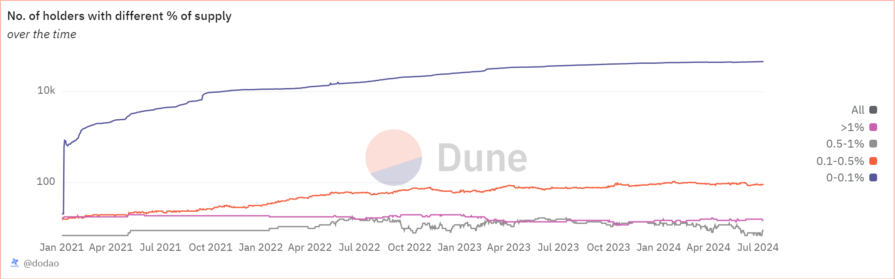

# About

This query calculates the number of token holders over time who hold various percentages of the total token supply for a specified token.

# Graph



# Relevance

This query helps analyze the distribution of token holdings over time, which is useful for understanding the concentration of token ownership. It can provide insights into the decentralization of token ownership, the emergence of whale holders, and how the distribution of token holdings changes over time.

# Query Explanation

This query calculates daily token balances for each address by aggregating token transfers and computing cumulative balances. It generates a sequence of days to ensure continuity, and determines the number of token holders within specific balance ranges as a percentage of total supply.

## Decimal Info

Retrieves the number of decimals for the specified token.

```sql
decimals_info_token AS (
    SELECT
      decimals
    FROM
      tokens.erc20
    WHERE
      contract_address = {{token_address}}
  )
```

## Total Supply

Computes the total supply of the token by summing up all transfer values.

```sql
token_total_supply AS (
    SELECT
      sum(tokens / POWER(10, d.decimals)) as total_supply
    FROM
      (
        SELECT
          wallet,
          sum(amount) AS tokens
        FROM
          (
            SELECT
              "to" AS wallet,
              contract_address,
              SUM(cast(value as double)) AS amount
            FROM
              erc20_{{chain}}.evt_Transfer tr
            WHERE
              contract_address = {{token_address}}
            GROUP BY
              1,
              2
            UNION ALL
            SELECT
              "from" AS wallet,
              contract_address,
              - SUM(cast(value as double)) AS amount
            FROM
              erc20_{{chain}}.evt_Transfer tr
            WHERE
              contract_address = {{token_address}}
            GROUP BY
              1,
              2
          ) t
        GROUP BY
          1
      ) a
      CROSS JOIN decimals_info_token d
    WHERE
      tokens > 0
  ),
```

## Number of tokens transferred in and out

Aggregates daily token transfers, summing the amounts for each address and day.

```sql
token_transfers AS (
    SELECT
      DAY,
      address,
      token_address,
      SUM(amount) AS amount
    FROM
      (
        SELECT
          DATE_TRUNC('day', evt_block_time) AS DAY,
          "to" AS address,
          tr.contract_address AS token_address,
          CAST(value AS DECIMAL (38, 0)) AS amount
        FROM
          erc20_{{chain}}.evt_Transfer AS tr
        WHERE
          contract_address = {{token_address}}
        UNION ALL
        SELECT
          DATE_TRUNC('day', evt_block_time) AS DAY,
          "from" AS address,
          tr.contract_address AS token_address,
          (-1) * (CAST(value AS DECIMAL (38, 0))) AS amount
        FROM
          erc20_{{chain}}.evt_Transfer AS tr
        WHERE
          contract_address = {{token_address}}
      ) AS t
    GROUP BY
      1,
      2,
      3
  )
```

## Token Balances with Gap Days

Calculates the running balance for each address over time and determines the next day when a transfer occurs for the same address.

```sql
token_balances_with_gap_days AS (
    SELECT
      t.day,
      address,
      SUM(amount) OVER (
        PARTITION BY
          address
        ORDER BY
          t.day
      ) AS balance,
      LEAD(DAY, 1, CURRENT_TIMESTAMP) OVER (
        PARTITION BY
          address
        ORDER BY
          t.day
      ) AS next_day
    FROM
      token_transfers AS t
  )
```

## Days Sequence

Generates a sequence of days from January 1, 2021, to the current date.

```sql
days AS (
    SELECT
      DAY
    FROM
      UNNEST (
        SEQUENCE(
          TRY_CAST('2021-01-01' AS TIMESTAMP),
          CAST(
            TRY_CAST(
              TRY_CAST(
                TRY_CAST(DATE_TRUNC('day', CURRENT_TIMESTAMP) AS TIMESTAMP) AS TIMESTAMP
              ) AS TIMESTAMP
            ) AS TIMESTAMP
          ),
          INTERVAL '1' day
        )
      ) AS _u (DAY)
  )
```

## Token Balance of All Days

Computes the balance for each address for each day, filling in the days between transfers.

```sql
token_balance_all_days AS (
    SELECT
      d.day,
      address,
      SUM(
        balance / TRY_CAST(POWER(10, di.decimals) AS DOUBLE)
      ) AS balance
    FROM
      token_balances_with_gap_days AS b
      INNER JOIN days AS d ON b.day <= d.day
      AND d.day < b.next_day
      CROSS JOIN decimals_info_token di
    GROUP BY
      1,
      2
    ORDER BY
      1,
      2
  )
```

## Holders in different ranges

Groups token holders into different categories based on the percentage of the total supply they hold.

```sql
token_holders_with_token_value AS (
    SELECT
      b.day AS "Date",
      COUNT(
        CASE
          WHEN b.balance > 0
          AND b.balance <= ts.total_supply * 0.001 THEN b.address
        END
      ) AS "0-0.1%",
      COUNT(
        CASE
          WHEN b.balance > ts.total_supply * 0.001
          AND b.balance <= ts.total_supply * 0.005 THEN b.address
        END
      ) AS "0.1-0.5%",
      COUNT(
        CASE
          WHEN b.balance > ts.total_supply * 0.005
          AND b.balance <= ts.total_supply * 0.01 THEN b.address
        END
      ) AS "0.5-1%",
      COUNT(
        CASE
          WHEN b.balance > ts.total_supply * 0.01 THEN b.address
        END
      ) AS ">1%"
    FROM
      token_balance_all_days AS b
      CROSS JOIN token_total_supply ts
    WHERE
      balance > 0
    GROUP BY
      b.day,
      ts.total_supply
  )
```

## Final Select

The final SELECT statement retrieves the date and counts of token holders for each range of the total supply.

```sql
SELECT
  htv_token."Date" AS "Date",
  COALESCE(htv_token."0-0.1%", 0) AS "0-0.1%",
  COALESCE(htv_token."0.1-0.5%", 0) AS "0.1-0.5%",
  COALESCE(htv_token."0.5-1%", 0) AS "0.5-1%",
  COALESCE(htv_token.">1%", 0) AS ">1%"
FROM
  token_holders_with_token_value htv_token
ORDER BY
  htv_token."Date";
```

## Tables used

- tokens.erc20 (Curated dataset for erc20 tokens with addresses, symbols and decimals. Origin unknown)
- erc20\_{{Blockchain}}.evt_Transfer (Curated dataset of erc20 tokens' transactions. Origin unknown)

