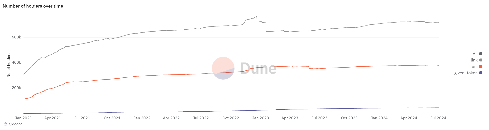

# About

The query for total number of holders helps determine how many unique addresses hold the specified token in non-trivial amounts (at least 1 token).
The graph for number of holders over time displays the total number of unique addresses holding an asset with a threshold range and over a period of time.

# Graph





# Relevance

Understanding Asset Distribution:
By knowing number of holders, we get to know how widely it is being used, more number of holders show asset’s adoption. Low number represents biased and a pre made setup.

Assessing Popularity and Trust:
The number of holders show the asset's popularity. An asset with more number of holders show that it is more trustworthy and in demand.

Market Sentiment:
number of holders over time can provide insights into market activity. For example, a sudden increase in the number of holders indicate positive news or increased investor interest, while a decrease might suggest negative sentiment or sell-offs.

Identifying Trends and Patterns:
Number of holders can help identify trends, such as whether the asset is becoming more popular or if there is a concentration of holdings among a few addresses, which might indicate potential market manipulation or whale activity. Number of holders and how much they are holding and what has been the trend over time to show the stability and to show that it hasnt gained popularity just now.

# Query Explanation

## total number of holders

This query calculates the number of unique holders of a given token on a given blockchain. It does so by:

- Calculating the total amount of tokens received and sent by each address.
- Aggregating these transfers to determine the net holdings for each address.
- Filtering out addresses with net holdings less than 1 token.
- Counting the number of unique addresses with net holdings of at least 1 token.

Filters and retrieves transfer events for the specified token, excluding self-transfers

```sql
transfers AS (
    SELECT
      evt_block_time,
      contract_address,
      "from",
      to,
      value
    FROM
      erc20_{{chain}}.evt_Transfer
    WHERE
      contract_address = {{token_address}}
      AND "from" <> to
  ),
```

Calculates the balance changes for each address by summing the incoming (to address) and outgoing (from address) token values

```sql
balances AS (
    SELECT
      contract_address,
      to AS address,
      SUM(value) AS balance
    FROM
      transfers
    GROUP BY
      contract_address,
      to
    UNION ALL
    SELECT
      contract_address,
      "from" AS address,
      - SUM(value) AS balance
    FROM
      transfers
    GROUP BY
      contract_address,
      "from"
  ),
```

Aggregates the balance changes to get the final balance for each address

```sql
final_balances AS (
    SELECT
      contract_address,
      address,
      SUM(balance) AS balance
    FROM
      balances
    GROUP BY
      contract_address,
      address
  )
```

Counts the number of unique addresses (address) holding a positive token balance

```sql
SELECT
  COUNT(*) AS distinct_holders
FROM
  final_balances
WHERE
  balance > 0
```

### Tables used

- erc20\_{{Blockchain}}.evt_Transfer (Curated dataset of erc20 tokens' transactions. Origin unknown)

### Alternative Choices

- {{Blockchain}}.transactions (Raw data of a chain containing all kinds of transactions)

## number of holders over time

The query aims to calculate the cumulative number of unique token holders on a daily basis for a specific token on a given blockchain. It does so by tracking the first day each address held a balance, and then sum up the new holders cumulatively.

- Truncates the event block time to the day level.
- Aggregates the token transfers by day and address, converting the token value to a human-readable format.
- Groups the results by day and address.

This query also uses the same CTE transfers, balances, balance_with_gap_days, days and balance_all_days

The token_holders_with_balance CTE calculates the number of unique addresses (holders) with a positive balance for each day from the token_balance_all_days data

```sql
token_holders_with_balance AS (
    SELECT
      b.day AS "Date",
      COUNT(address) AS "Holders with Balance"
    FROM
      token_balance_all_days AS b
    WHERE
      balance > 0
    GROUP BY
      b.day
  )
```

It finally retrieves the number of holders with a balance greater than zero for three tokens (given token, UNI, and LINK) on each day

```sql
SELECT
  COALESCE(hwb_token."Date", hwb_uni."Date", hwb_link."Date") AS "Date",
  COALESCE(hwb_token."Holders with Balance", 0) AS "Token Holders with Balance",
  COALESCE(hwb_uni."Holders with Balance", 0) AS "UNI Holders with Balance",
  COALESCE(hwb_link."Holders with Balance", 0) AS "LINK Holders with Balance"
FROM
  token_holders_with_balance hwb_token
  FULL JOIN uni_holders_with_balance hwb_uni ON hwb_token."Date" = hwb_uni."Date"
  FULL JOIN link_holders_with_balance hwb_link ON hwb_token."Date" = hwb_link."Date"
ORDER BY
  COALESCE(hwb_token."Date", hwb_uni."Date", hwb_link."Date");
```

### Tables used

- erc20\_{{Blockchain}}.evt_Transfer (Curated dataset of erc20 tokens' transactions. Origin unknown)

### Alternative Choices

- {{Blockchain}}.transactions (Raw data of a chain containing all kinds of transactions)

## number of holders over time having token value greater than $1000

This query calculates the number of Ethereum token holders over time, specifically for a given token, UNI, and LINK. The query also determines the number of holders who possess more than $1000 worth of tokens based on daily prices

This query also uses the same CTE transfers, balances, balance_with_gap_days, days and balance_all_days

Calculates the daily average price for each token

```sql
token_daily_prices AS (
    SELECT
      er.decimals,
      DATE_TRUNC('day', hour) AS day,
      AVG(dx.median_price) AS price
    FROM
      dex.prices dx
      JOIN tokens.erc20 er ON er.contract_address = {{token_address}}
    WHERE
      dx.contract_address = {{token_address}}
      AND er.blockchain = '{{chain}}'
    GROUP BY
      er.decimals,
      DATE_TRUNC('day', hour)
  )
```

Counts the number of holders for each day whose token holdings exceed $1000

```sql
token_holders_with_token_value AS (
    SELECT
      b.day AS "Date",
      COUNT(
        CASE
          WHEN (balance * p.price / POWER(10, p.decimals)) > 1000 THEN address
        END
      ) AS "Holders with Token Value > $1000"
    FROM
      token_balance_all_days AS b
      LEFT JOIN token_daily_prices AS p ON b.day = p.day
    WHERE
      balance > 0
    GROUP BY
      b.day
  )
```

The final SELECT statement combines the data from the above CTEs using FULL JOINs to ensure that the result set includes all relevant dates, even if some tokens don't have data for every day

```sql
SELECT
  COALESCE(htv_token."Date", htv_uni."Date", htv_link."Date") AS "Date",
  COALESCE(htv_token."Holders with Token Value > $1000", 0) AS "Token Holders with Token Value > $1000",
  COALESCE(htv_uni."Holders with Token Value > $1000", 0) AS "UNI Holders with Token Value > $1000",
  COALESCE(htv_link."Holders with Token Value > $1000", 0) AS "LINK Holders with Token Value > $1000"
FROM
  token_holders_with_token_value htv_token
  FULL JOIN uni_holders_with_token_value htv_uni ON htv_token."Date" = htv_uni."Date"
  FULL JOIN link_holders_with_token_value htv_link ON htv_token."Date" = htv_link."Date"
where
  htv_token."Holders with Token Value > $1000" > 0
ORDER BY
  COALESCE(htv_token."Date", htv_uni."Date", htv_link."Date");
```

### Tables used

- erc20\_{{Blockchain}}.evt_Transfer (Curated dataset of erc20 tokens' transactions. Origin unknown)
- dex.prices (This table loads the prices of tokens from the dex.trades table. This helps for missing tokens from the prices.usd table. Made by @henrystats. Present in the spellbook of dune analytics [Spellbook-Dex-Prices](https://github.com/duneanalytics/spellbook/blob/main/models/dex/dex_schema.yml))
- tokens.erc20 (Curated dataset for erc20 tokens with addresses, symbols and decimals. Origin unknown)

### Alternative Choices

## number of holders over time having token value less than or equal to $1000

This query calculates the number of token holders over time, specifically for a given token, UNI, and LINK, who possess tokens with a value of $1000 or less based on daily prices.

This query also uses the same CTE transfers, balances, balance_with_gap_days, days and balance_all_days

Calculates the daily average price for each token

```sql
token_daily_prices AS (
    SELECT
      er.decimals,
      DATE_TRUNC('day', hour) AS day,
      AVG(dx.median_price) AS price
    FROM
      dex.prices dx
      JOIN tokens.erc20 er ON er.contract_address = {{token_address}}
    WHERE
      dx.contract_address = {{token_address}}
      AND er.blockchain = '{{chain}}'
    GROUP BY
      er.decimals,
      DATE_TRUNC('day', hour)
  )
```

This CTE calculates the number of token holders who have a token value less than or equal to $1000 on each day

```sql
token_holders_with_token_value AS (
    SELECT
      b.day AS "Date",
      COUNT(
        CASE
          WHEN (balance * p.price / POWER(10, p.decimals)) <= 1000 THEN address
        END
      ) AS "Holders with Token Value <= $1000"
    FROM
      token_balance_all_days AS b
      LEFT JOIN token_daily_prices AS p ON b.day = p.day
    WHERE
      balance > 0
    GROUP BY
      b.day
  )
```

This final statement retrieves the number of token holders with token values less than or equal to $1000 for the specified token, UNI, and LINK, merging the data by date.

```sql
SELECT
  COALESCE(htv_token."Date", htv_uni."Date", htv_link."Date") AS "Date",
  COALESCE(htv_token."Holders with Token Value <= $1000", 0) AS "Token Holders with Token Value <= $1000",
  COALESCE(htv_uni."Holders with Token Value <= $1000", 0) AS "UNI Holders with Token Value <= $1000",
  COALESCE(htv_link."Holders with Token Value <= $1000", 0) AS "LINK Holders with Token Value <= $1000"
FROM
  token_holders_with_token_value htv_token
  FULL JOIN uni_holders_with_token_value htv_uni ON htv_token."Date" = htv_uni."Date"
  FULL JOIN link_holders_with_token_value htv_link ON htv_token."Date" = htv_link."Date"
where
  htv_token."Holders with Token Value <= $1000" > 0
ORDER BY
  COALESCE(htv_token."Date", htv_uni."Date", htv_link."Date");
```

### Tables used

- erc20\_{{Blockchain}}.evt_Transfer (Curated dataset of erc20 tokens' transactions. Origin unknown)
- dex.prices (This table loads the prices of tokens from the dex.trades table. This helps for missing tokens from the prices.usd table. Made by @henrystats. Present in the spellbook of dune analytics [Spellbook-Dex-Prices](https://github.com/duneanalytics/spellbook/blob/main/models/dex/dex_schema.yml))
- tokens.erc20 (Curated dataset for erc20 tokens with addresses, symbols and decimals. Origin unknown)

### Alternative Choices
