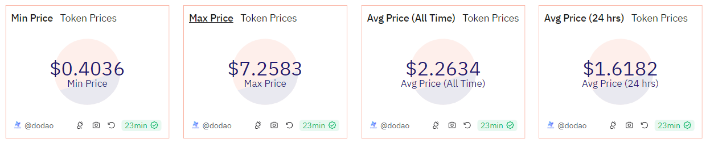

# About

Here we show various price metrics for the given token on the specified blockchain. The metrics include minimum price, maximum price, average price, and average price over the last 24 hours.

# Graph



# Relevance

Calculating these price metrics is essential for many reasons:

- Minimum and Maximum Prices: Understanding the price range (min and max prices) gives insight into the volatility and stability of the token's price over time.
- Average Price: The average price provides a general idea of the token's overall price level and can be used as a benchmark for comparison with the current price.
- Average Price over 24 Hours: The 24-hour average price helps in assessing short-term price trends and market sentiment, which is crucial for traders and investors.

# Query Explanation

The query simply selects the prices from the prices USD table for the given token and blockchain. Then calculates the price metrics by using aggregate functions and time interval.

Data CTE selects the `minute` and `price` from the `prices.usd` table where the token address and blockchain match the given values.

```sql
data as (
    select
      minute,
      price
    from
      prices.usd
    where
      contract_address = {{token_address}}
      and blockchain = '{{chain}}'
  )
```

Selects hour-level price data for the same token and blockchain.

```sql
data_max_price as (
    select
      hour,
      median_price as price
    from
      dex.prices
    where
      contract_address = {{token_address}}
      and blockchain = '{{chain}}'
  )
```

Minimum price data CTE calculates the minimum price from the data.

```sql
min_price_data as (
    select
      min(price) as min_price
    from
      data
  )
```

Maximum price data CTE calculates the maximum price from the data_max_price.

```sql
max_price_data as (
    select
      max(price) as max_price
    from
      data_max_price
  )
```

Average price data CTE calculates the average price from the data.

```sql
avg_price_data as (
    select
      avg(price) as avg_price
    from
      data
  )
```

Average price 24h data CTE calculates the average price over the last 24 hours by filtering the data to include only the rows where hour is within the last 24 hours.

```sql
avg_price_24h_data as (
    select
      avg(price) as avg_price_24h
    from
      data
    where
      minute >= CURRENT_TIMESTAMP - INTERVAL '24' hour
  )
```

Finally retrieves the calculated metrics from each CTE and presents them in a single result set:

```sql
select
  (
    select
      latest_price
    from
      latest_data
  ) as latest_price,
  (
    select
      min_price
    from
      min_price_data
  ) as min_price,
  (
    select
      max_price
    from
      max_price_data
  ) as max_price,
  (
    select
      avg_price
    from
      avg_price_data
  ) as avg_price,
  (
    select
      avg_price_24h
    from
      avg_price_24h_data
  ) as avg_price_24h;
```

## Tables used

- dex.prices (This table loads the prices of tokens from the dex.trades table. This helps for missing tokens from the prices.usd table. Made by @henrystats. Present in the spellbook of dune analytics [Spellbook-Dex-Prices](https://github.com/duneanalytics/spellbook/blob/main/models/dex/dex_schema.yml))
- prices.usd (Curated dataset contains token addresses and their USD prices.)

## Alternative Choices
