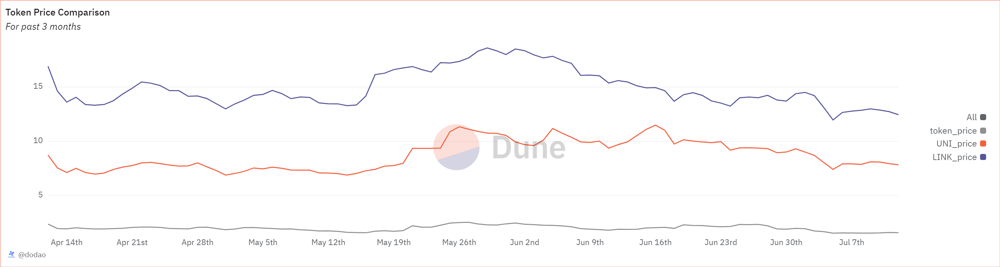

# About

This query calculates the average daily prices for a specified token, Uniswap (UNI), and Chainlink (LINK) over the past three months. 

# Graph



# Relevance

This query is useful for analyzing the daily price trends of multiple tokens over a specified period (in this case, the past three months). It can help in comparative analysis and understanding the market behavior of different tokens relative to each other.

# Query Explanation

This query achieves the results by retrieving minute-level price data, aggregating it to a daily level, and then combining the results into a single dataset. The output provides a day-by-day comparison of the token prices

Aggregates the average price of a specified token by day.

```sql
token_prices AS (
    SELECT
      DATE(minute) AS day,
      avg(price) AS token_price
    FROM
      prices.usd
    WHERE
      contract_address = {{token_address}}
      and blockchain = '{{chain}}'
      AND minute >= CURRENT_DATE - INTERVAL '3' month
    GROUP BY
      DATE(minute)
  )
```

The SELECT statement retrieves the day and the respective average prices from each CTE.

```sql
SELECT
  l.day,
  l.token_price,
  e.ETH_price,
  u.UNI_price,
  k.LINK_price
FROM
  token_prices l
  INNER JOIN eth_prices e ON l.day = e.day
  INNER JOIN uni_prices u ON l.day = u.day
  INNER JOIN link_prices k ON l.day = k.day
ORDER BY
  l.day;
```

## Tables used

- prices.usd (Curated dataset contains token addresses and their USD prices.)

## Alternative Choices
