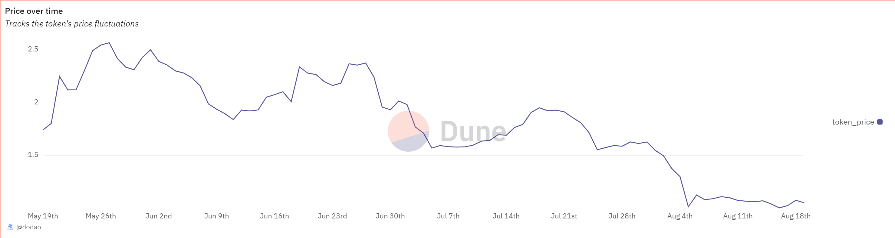

# About

This query calculates the average daily prices for a specified token over the past three months. 

# Graph



# Relevance

This query is useful for analyzing the daily price trends of given tokens over a specified period (in this case, the past three months). It can help in comparative analysis and understanding the market behavior. Daily price data is essential for understanding market trends, assessing volatility, evaluating performance, and informing technical analysis, empowering users to make informed investment decisions and manage risk effectively.

# Query Explanation

This query achieves the results by retrieving minute-level price data, aggregating it to a daily level, and then combining the results into a single dataset. The output provides a day-by-day comparison of the token prices

Aggregates the average price of a specified token by day.

```sql
WITH
  token_prices AS (
    SELECT
      DATE(minute) AS day,
      avg(price) AS token_price
    FROM
      prices.usd
    WHERE
      contract_address = {{token_address}}
      and blockchain = '{{chain}}'
      AND minute >= CURRENT_DATE - INTERVAL '3' month
    GROUP BY
      DATE(minute)
  )
```

The final SELECT statement retrieves and orders the daily token prices over the specified period, providing a chronological view of how the token's price has fluctuated day by day.

```sql
SELECT
  l.day,
  l.token_price
FROM
  token_prices l
ORDER BY
  l.day;
```

## Tables used

- prices.usd (Curated dataset contains token addresses and their USD prices.)

## Alternative Choices
