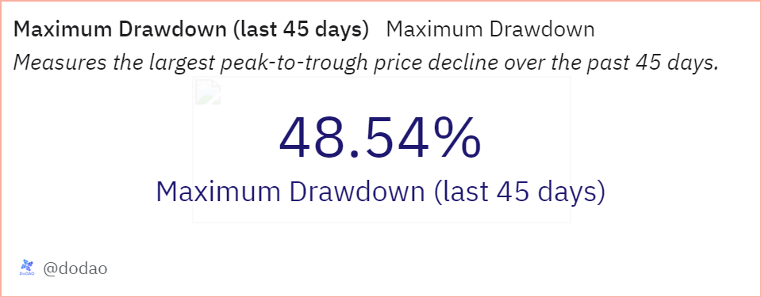

# About

This query calculates the Maximum Drawdown (MDD) for a specific token over the last 45 days. The MDD is calculated as the percentage decline from this peak to the lowest price, offering a clear measure of the token's price volatility and risk.

# Graph



# Relevance

Understanding the Maximum Drawdown is crucial for users interested in assessing the risk associated with holding a token. This metric provides insight into the potential for significant price declines, which can inform investment decisions, risk management strategies, and overall market analysis. By quantifying the worst-case scenario of price drops, this query helps users better understand the token's historical price behavior and its resilience to market fluctuations.

# Query Explanation

This CTE calculates the daily average price of the token over the last 45 days by grouping and averaging the minute-by-minute price data.

```sql
token_prices AS (
    SELECT
      DATE(minute) AS day,
      AVG(price) AS token_price
    FROM
      prices.usd
    WHERE
      contract_address = {{token_address}}
      AND blockchain = '{{chain}}'
      AND minute >= CURRENT_DATE - INTERVAL '45' DAY
    GROUP BY
      DATE(minute)
  ),
```

This CTE selects the day with the highest average token price within the last 45 days, identifying the peak price.

```sql
max_price AS (
    SELECT
      day,
      token_price
    FROM
      token_prices
    ORDER BY
      token_price DESC
    LIMIT
      1
  ),
```

This CTE finds the minimum token price that occurred after the day with the maximum price, which is necessary to calculate the maximum drawdown.

```sql
min_price_after_max AS (
    SELECT
      MIN(token_price) AS min_price
    FROM
      token_prices
    WHERE
      day > (
        SELECT
          day
        FROM
          max_price
      )
  )
```

This calculates the Maximum Drawdown (MDD) as a percentage, using the formula providing a measure of the largest price decline from the peak within the given period.

```sql
SELECT
  (
    (
      SELECT
        token_price
      FROM
        max_price
    ) - (
      SELECT
        min_price
      FROM
        min_price_after_max
    )
  ) / (
    SELECT
      token_price
    FROM
      max_price
  ) * 100 AS max_drawdown;
```

## Tables used

- prices.usd (Curated dataset contains token addresses and their USD prices.)

## Alternative Choices
