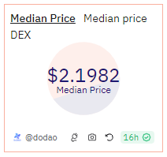

# About

The median price is a key metric that provides a more stable and accurate reflection of an asset's value by mitigating the impact of outliers and extreme values, compared to the average price, which can be skewed by large trades or market manipulation.

# Graph



# Relevance

Calculating the median DEX price is important for many reasons:

- Accurate Market Valuation: The median price offers a fairer market valuation by filtering out extreme values and anomalies, providing a more stable and accurate reflection of the asset's value compared to the average price.
- Enhanced Trading Decisions: Traders and investors can use the median price to make informed decisions about buying or selling an asset, providing a reliable benchmark for determining entry and exit points.
- Risk Management: The median price can be less volatile (fluctuating) than the average price, providing a better measure for risk assessment and management.
- Arbitrage Opportunities: By comparing the median price across multiple DEXs, traders can identify arbitrage opportunities where they can buy low on one exchange and sell high on another.

# Query Explanation

The query simply selects the median prices from the DEX prices table for the given token and blockchain. Then calculates the number of total rows and get the avg median price for the whole data by adjusting for even and odd number or rows. As there will be one middle row in case of odd number of rows but in case of even number of rows, there will be two middle rows and have to take average of them.

Price data CTE selects the `median_price` and `hour` from the `dex.prices` table where the token address and blockchain match the given values.

```sql
price_data AS (
    SELECT
      median_price,
      hour
    FROM
      dex.prices
    WHERE
      contract_address = {{token_address}}
      AND blockchain = '{{chain}}'
  )
```

Ranked prices CTE assigns a row number to each row ordered by `median_price` and computes the total number of rows.

```sql
ranked_prices AS (
    SELECT
        median_price,
        ROW_NUMBER() OVER (ORDER BY median_price) AS row_num,
        COUNT(*) OVER () AS total_rows
    FROM
        price_data
)
```

Finally calculates the median by averaging the median_price of the middle row(s). For odd numbers of rows, it will average the single middle row. For even numbers of rows, it will average the two middle rows. The `WHERE` clause filters to the middle row(s) using `FLOOR` and `CEIL` functions to handle both odd and even total row counts.

```sql
SELECT
    AVG(median_price) AS median_dex_price
FROM
    ranked_prices
WHERE
    row_num IN (FLOOR((total_rows + 1) / 2.0), CEIL((total_rows + 1) / 2.0));
```

**Hardcoded addresses**

## Tables used

- dex.prices (This table loads the prices of tokens from the dex.trades table. This helps for missing tokens from the prices.usd table. Made by @henrystats. Present in the spellbook of dune analytics [Spellbook-Dex-Prices](https://github.com/duneanalytics/spellbook/blob/main/models/dex/dex_schema.yml))

## Alternative Choices
