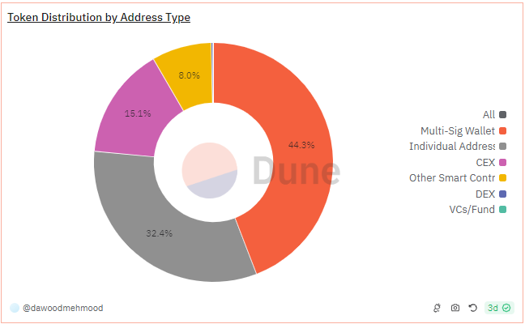

# About

The graph shows participation of different entities in the market and how much percentage of the total asset they hold.

# Graph



# Relevance

This graph is relevant to understand the distribution of the asset among different entities. It helps to understand the flow of the asset in the market by different entities and the extent of decentralization of the asset. It also helps to understand the activity of the asset in the market.

For example:

- Large holding by exchange addresses shows active trading
- Holdings by smart contracts shows token’s utility
- Large holdings by individuals show broad adoption and support of the investors

# Query Explanation

This query calculates the distribution of token holdings by categorizing addresses into different types and summing their holdings. It considers various types of addresses like exchanges, smart contracts, multi-sig wallets, venture capital funds, and individual addresses. By joining price information and raw transfer data, it calculates the total holdings and their USD value, then filters and groups these holdings by address type.

Price CTE calculates the average price of the specified token and retrieves its symbol and decimals

```sql
price as (
select symbol , decimals, avg(token_price_usd) as price
from dex.prices_latest,tokens.erc20
where token_address = {{Token Contract Address}}
and contract_address = {{Token Contract Address}}
and blockchain = '{{Blockchain}}'
group by 1,2
)
```

Raw CTE calculates the net amount of tokens held by each address by summing up incoming and outgoing transfers

```sql
raw as (
select "from" as address, sum(cast(value as double)*-1) as amount
from
erc20_{{Blockchain}}.evt_Transfer
where contract_address = {{Token Contract Address}}
group by 1
union all
select "to" as address, sum(cast(value as double)) as amount
from erc20_{{Blockchain}}.evt_Transfer
where contract_address = {{Token Contract Address}}
group by 1)
```

Fund_address CTE creates a list of addresses corresponding to specific funds

```sql
fund_address as (
select address
FROM (
VALUES
(0x820fb25352bb0c5e03e07afc1d86252ffd2f0a18, 'Paradigm'),
(0x0716a17fbaee714f1e6ab0f9d59edbc5f09815c0, 'Jump Trading')
) AS t(address,name)
union all
select distinct address from labels.funds
)
```

Finally categorize each of the address into one of the several types, filtering out the null address:

- CEX: Centralized Exchange addresses.
- DEX: Decentralized Exchange addresses.
- Multi-Sig Wallet: Addresses identified as multi-signature wallets.
- Other Smart Contracts: Addresses identified as smart contracts but not as DEX, Multi-Sig, or Fund addresses
- VCs/Fund: Addresses identified as belonging to venture capital or funds.
- Individual Address: All other addresses.

Groups by address and type to sum their holdings and value.
Filters out addresses with a value of less than 1.
Aggregates the total holdings by address type.

```sql
SELECT
    type,
    SUM(amount) AS total_holdings
FROM (
    SELECT
        address,
        CASE
            WHEN address IN (SELECT DISTINCT address FROM cex_evms.addresses) OR
                 address IN (SELECT DISTINCT address FROM query_2296923)
                THEN 'CEX'
            WHEN address IN (SELECT DISTINCT project_contract_address FROM dex.trades)
                THEN 'DEX'
            WHEN address IN (SELECT DISTINCT address FROM safe.safes_all)
                THEN 'Multi-Sig Wallet'
            WHEN address IN (SELECT DISTINCT address FROM {{Blockchain}}.creation_traces) AND
                 address NOT IN (SELECT DISTINCT project_contract_address FROM dex.trades) AND
                 address NOT IN (SELECT DISTINCT address FROM safe.safes_all) AND
                 address NOT IN (SELECT DISTINCT address FROM fund_address)
                THEN 'Other Smart Contracts'
            WHEN address IN (SELECT DISTINCT address FROM fund_address)
                THEN 'VCs/Fund'
            ELSE 'Individual Address'
        END AS type,
        SUM(amount / POWER(10, decimals)) AS amount,
        SUM(amount * price / POWER(10, decimals)) AS value
    FROM 
        price,
        raw
    WHERE 
        address <> 0x0000000000000000000000000000000000000000
    GROUP BY 
        address, type
) AS a
WHERE 
    value > 1
GROUP BY 
    type;

```

## Tables used

- dex.prices_latest
- tokens.erc20
- erc20\_{{Blockchain}}.evt_Transfer
- labels.funds
- cex_evms.addresses
- query_2296923 (contains exchanges and their addresses)
- dex.trades
- safe.safes_all (contains multisig addresses)
- {{Blockchain}}.creation_traces

## Alternative Choices
