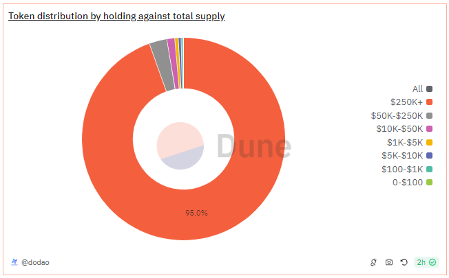

# About

The graph shows percentage of the total supply of the holdings for the addresses that falls in the defined ranges (0 - $100, $100 - $1000, $1000 - $5,000, $5000 - $10,000, $10,000 - $50,000 , $50,000 - $250,000 , 250,000+). These ranges show USD total of the holdings for an address.

# Graph



# Relevance

This graph is relevant to understand the distribution of a token's supply among different holders. It helps to understand the extent of decentralization of the asset in the market.

Example Scenario
Imagine you're analyzing a new DeFi token. By using this query, you can determine:

- What percentage of the supply is held by small investors (e.g., those holding less than $100).
- How much of the supply is concentrated in the hands of a few large investors (e.g., those holding more than $1 million).
- The overall distribution pattern, which helps in assessing whether the token is widely adopted or controlled by a few entities.

# Query Explanation

The query works by first categorizing the addresses based on their holdings in USD into predefined ranges, and then it sums up the holdings within each range. Finally, it calculates the percentage of the total circulating supply that these summed holdings represent.

Price CTE calculates the average price of the specified token and retrieves its symbol and decimals

```sql
price AS (
    SELECT
        symbol,
        decimals,
        AVG(token_price_usd) AS price
    FROM
        dex.prices_latest
    JOIN tokens.erc20 ON contract_address = {{token_address}}
    WHERE
        token_address = {{token_address}}
        AND blockchain = '{{chain}}'
    GROUP BY
        symbol,
        decimals
)
```

Raw CTE calculates the net amount of tokens held by each address by summing up incoming and outgoing transfers

```sql
raw AS (
    SELECT
        "from" AS address,
        SUM(CAST(value AS DOUBLE) * -1) AS amount
    FROM
        erc20_{{chain}}.evt_Transfer
    WHERE
        contract_address = {{token_address}}
    GROUP BY
        "from"
    UNION ALL
    SELECT
        "to" AS address,
        SUM(CAST(value AS DOUBLE)) AS amount
    FROM
        erc20_{{chain}}.evt_Transfer
    WHERE
        contract_address = {{token_address}}
    GROUP BY
        "to"
)
```

Holdings CTE calculates the holdings in USD for each address excluding the burner addresses.

```sql
holdings AS (
    SELECT
        address,
        SUM(amount / POWER(10, decimals)) AS holding,
        SUM(amount * price / POWER(10, decimals)) AS holding_usd
    FROM
        price,
        raw
    WHERE
        address NOT IN (
            0x0000000000000000000000000000000000000000,
            0x000000000000000000000000000000000000dEaD
        )
    GROUP BY
        address,
        decimals,
        price
)
```

Categorized holdings CTE categorizes the holdings into defined ranges, where holding is greater than 0. It uses a `CASE` statement to assign a category to each address based on their total holding value in USD.

```sql
categorized_holdings AS (
    SELECT
        address,
        holding,
        holding_usd,
        CASE
            WHEN holding_usd BETWEEN 0 AND 100 THEN '0-$100'
            WHEN holding_usd > 100 AND holding_usd <= 1000 THEN '$100-$1K'
            WHEN holding_usd > 1000 AND holding_usd <= 5000 THEN '$1K-$5K'
            WHEN holding_usd > 5000 AND holding_usd <= 10000 THEN '$5K-$10K'
            WHEN holding_usd > 10000 AND holding_usd <= 50000 THEN '$10K-$50K'
            WHEN holding_usd > 50000 AND holding_usd <= 250000 THEN '$50K-$250K'
            WHEN holding_usd > 250000 THEN '$250K+'
        END AS holding_category
    FROM
        holdings
    WHERE
        holding_usd > 0
)
```

Circulating supply CTE calculates the total circulating supply of the token. It sums up the holdings of all addresses to get the total supply.

```sql
circulating_supply AS (
    SELECT SUM(holding) AS total_supply
    FROM holdings
)
```

Finally selects the holding categories and calculates the total holdings and their percentage of the circulating supply for each category. It groups the data by holding category and sums the holdings. It calculates the percentage of the circulating supply for each category by dividing the total holding of each category by the total circulating supply.

```sql
SELECT
    holding_category,
    SUM(holding) AS total_holding,
    SUM(holding) / (SELECT total_supply FROM circulating_supply) * 100 AS percentage_of_supply
FROM
    categorized_holdings
GROUP BY
    holding_category
ORDER BY
    (CASE
        WHEN holding_category = '0-$100' THEN 1
        WHEN holding_category = '$100-$1K' THEN 2
        WHEN holding_category = '$1K-$5K' THEN 3
        WHEN holding_category = '$5K-$10K' THEN 4
        WHEN holding_category = '$10K-$50K' THEN 5
        WHEN holding_category = '$50K-$250K' THEN 6
        WHEN holding_category = '$250K+' THEN 7
    END);
```

**Hardcoded addresses**

- [0x0000000000000000000000000000000000000000](https://etherscan.io/address/0x0000000000000000000000000000000000000000): This address is not owned by any user, is often associated with token burn & mint/genesis events and used as a generic null address
- [0x000000000000000000000000000000000000dEaD](https://etherscan.io/address/0x000000000000000000000000000000000000dEaD): This address is commonly used by projects to burn tokens (reducing total supply).

## Tables used

- dex.prices_latest (Curated dataset contains token addresses and their USD price. Made by @bernat. Present in the spellbook of dune analytics [Spellbook-Dex-PricesLatest](https://github.com/duneanalytics/spellbook/blob/main/models/dex/dex_prices_latest.sql))
- tokens.erc20 (Curated dataset for erc20 tokens with addresses, symbols and decimals. Origin unknown)
- erc20\_{{Blockchain}}.evt_Transfer (Curated dataset of erc20 tokens' transactions. Origin unknown)

## Alternative Choices
