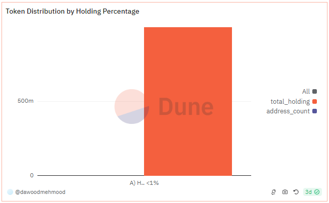

# About

This graph shows how the total supply of a token is distributed among the token holders

# Graph



# Relevance

## Asset decentralization

    Token distribution by holding % tells us how decentralized or centeralized the asset is. A more decentralized distribution, in which large number of addresses hold smaller percentages of the total supply, suggests a good ecosystem. On the other hand, a distribution, where a few addresses hold large portions of the supply, indicates market manipulation, liquidity issues or governance issues

## Holder Categories

- Investors: addresses holding less than 1% of the total supply represent retail investors. A large number of such addresses indicate broad adoption and support.
- Whales: Addresses holding more than 5-10% of the total supply are considered whales. Monitoring whale activity can provide insights into potential market movements or strategic investments.
- Institutional Investors: Addresses holding significant but not excessively large percentages (e.g., 1-5%) might represent institutional investors or large stakeholders.

# Query Explanation

This query calculates the distribution of token holdings by categorizing addresses into various percentage ranges. It considers the price and decimals of the token, sums the incoming and outgoing transfers to determine net holdings, and calculates the holding value in USD. The query then categorizes these holdings into ranges, counts the number of addresses in each range, and sums the total holdings for each range, filtering out addresses with negligible holdings.

Price CTE calculates the average price of the specified token and retrieves its symbol and decimals

```sql
  price as (
    select
      symbol,
      decimals,
      avg(token_price_usd) as price
    from
      dex.prices_latest,
      tokens.erc20
    where
      token_address = {{Token Contract Address}}
      and contract_address = {{Token Contract Address}}
      and blockchain = '{{Blockchain}}'
    group by
      1,
      2
  )
```

Raw CTE calculates the net amount of tokens held by each address by summing up incoming and outgoing transfers

```sql
raw as (
    select
      "from" as address,
      sum(cast(value as double) * -1) as amount
    from
      erc20_{{Blockchain}}.evt_Transfer
    where
      contract_address = {{Token Contract Address}}
    group by
      1
    union all
    select
      "to" as address,
      sum(cast(value as double)) as amount
    from
      erc20_{{Blockchain}}.evt_Transfer
    where
      contract_address = {{Token Contract Address}}
    group by
      1
  )
```

Finally categorizes addresses based on their percentage holdings, counts the number of addresses in each category, and sums their total holdings.

- Categorizes addresses based on percent_holdings into various ranges.
- Counts the number of distinct addresses (address_count) in each category.
- Sums the total holdings (total_holding) for each category.
- Filters out addresses with a holding value of less than $1 USD as well as null and burner addresses
- Groups by the holding percentage category.

```sql
select
  case
    when percent_holdings >= 0.5 then 'H) Holdings >=50%'
    when percent_holdings >= 0.4
    and percent_holdings < 0.5 then 'G) Holdings >=40% & <50%'
    when percent_holdings >= 0.3
    and percent_holdings < 0.4 then 'F) Holdings >=30% & <40%'
    when percent_holdings >= 0.2
    and percent_holdings < 0.3 then 'E) Holdings >=20% & <30%'
    when percent_holdings >= 0.1
    and percent_holdings < 0.2 then 'D) Holdings >=10% & <20%'
    when percent_holdings >= 0.05
    and percent_holdings < 0.1 then 'C) Holdings >=5% & <10%'
    when percent_holdings >= 0.01
    and percent_holdings < 0.05 then 'B) Holdings >=1% & <5%'
    when percent_holdings < 0.01 then 'A) Holdings <1%'
  end as distribution,
  count(distinct address) as address_count,
  sum(holding) as total_holding
from
  (
    select
      address,
      sum(amount / power(10, decimals)) as holding,
      sum(amount * price / power(10, decimals)) as holding_usd,
      sum(amount) / (
        select
          sum(amount)
        from
          raw
        where
          address not in (
            0x0000000000000000000000000000000000000000,
            0x000000000000000000000000000000000000dEaD,
            0xD15a672319Cf0352560eE76d9e89eAB0889046D3
          )
      ) as percent_holdings
    from
      price,
      raw
    where
      address not in (
        0x0000000000000000000000000000000000000000,
        0x000000000000000000000000000000000000dEaD,
        0xD15a672319Cf0352560eE76d9e89eAB0889046D3
      )
    group by
      1
  ) a
where
  holding_usd > 1
group by
  1
```

## Tables used

- dex.prices_latest
- tokens.erc20
- erc20\_{{Blockchain}}.evt_Transfer

## Alternative Choices
