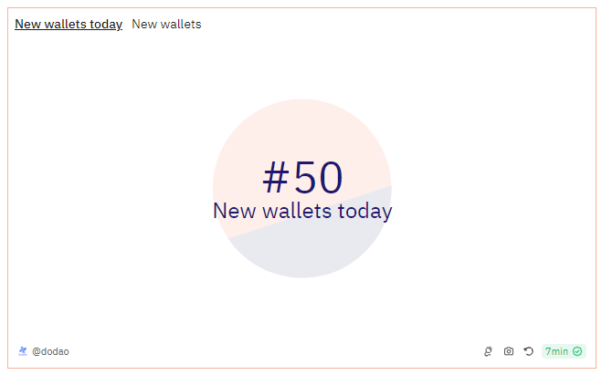
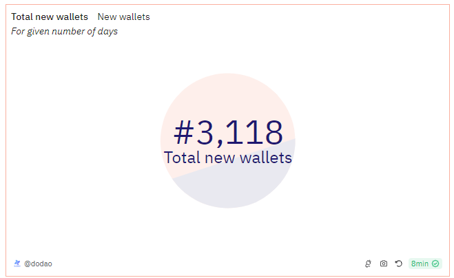
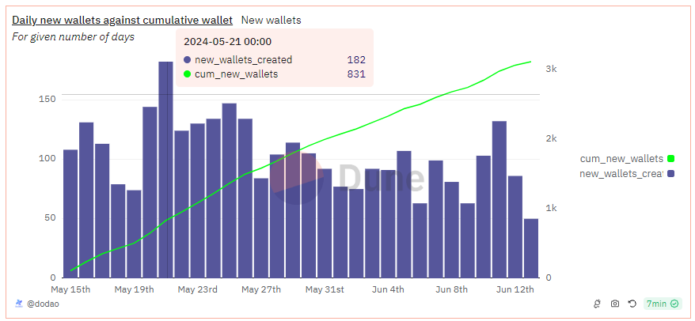
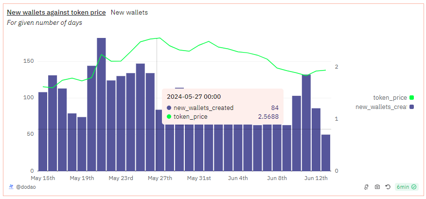

# About

The graphs show number of wallets created today and total wallets created for the given period of time. The comparison graphs show new wallets created against the cumulative number of wallets and new wallets being created against the token price.

# Graph






# Relevance

- User Adoption and Growth: Tracking new wallets provides insights into user adoption and growth within the ecosystem. An increasing number of new wallets indicates growing interest and participation in the token, which is a positive signal for the asset's adoption and potential market expansion.
- Market Sentiment: Correlating new wallet creation with token price helps in understanding market sentiment and user behavior. If new wallet creation spikes during price increases, it may indicate speculative interest. Conversely, steady wallet creation during price stability suggests organic growth and long-term confidence in the token.
- Investor Insights: Investors can use this data to analyze onboarding of new participants and their potential impact on the market. A high rate of new wallet creation could signify increased demand and liquidity for the token, attracting more investors and potentially driving up the token's value.

# Query Explanation

This query analyze the creation of new wallets over time and correlate this with the token price and cumulative number of wallets being created over the time.

New transfer CTE identifies the first transaction for each new wallet that received the token, helps in determining when each new wallet first interacted with the token.

```sql
new_transfers AS (
    SELECT
        to AS wallet,
        MIN(evt_block_time) AS time
    FROM
        erc20_{{chain}}.evt_Transfer
    WHERE
        contract_address = {{token_address}}
    GROUP BY
        1
)
```

New wallets CTE aggregates the count of new wallets created on each day.

```sql
new_wallets AS (
    SELECT
        COUNT(*) AS new_wallets,
        DATE_TRUNC('day', time) AS day
    FROM
        new_transfers
    GROUP BY
        2
)
```

Prices CTE calculates the average daily price of the token.

```sql
prices AS (
    SELECT
        AVG(price) AS price,
        DATE_TRUNC('day', minute) AS day
    FROM
        prices.usd_forward_fill
    WHERE
        contract_address = {{token_address}}
        AND blockchain = '{{chain}}'
        AND minute > NOW() - INTERVAL '{{day}}' day
    GROUP BY
        2
)
```

Finally combines the count of new wallets with the token price data for the specified period.

```sql
SELECT
    a.new_wallets AS new_wallets_created,
    SUM(a.new_wallets) OVER (
        ORDER BY
            a.day NULLS FIRST
    ) AS cum_new_wallets,
    a.day AS day,
    b.price AS token_price
FROM
    new_wallets AS a
    LEFT JOIN prices AS b ON a.day = b.day
WHERE
    a.day > NOW() - INTERVAL '{{day}}' day
ORDER BY
    a.day DESC

```

## Tables used

- erc20\_{{Blockchain}}.evt_Transfer (Curated dataset of erc20 tokens' transactions. Origin unknown)
- prices.usd_forward_fill (Curated dataset that presents view on prices that does a forward fill on the last 24h till the current timestamp. Made by @0xRob. Present in the spellbook of dune analytics [Spellbook-Prices-USD-Forward-Fill](https://github.com/duneanalytics/spellbook/blob/main/models/prices/prices_usd_forward_fill.sql))

## Alternative Choices
