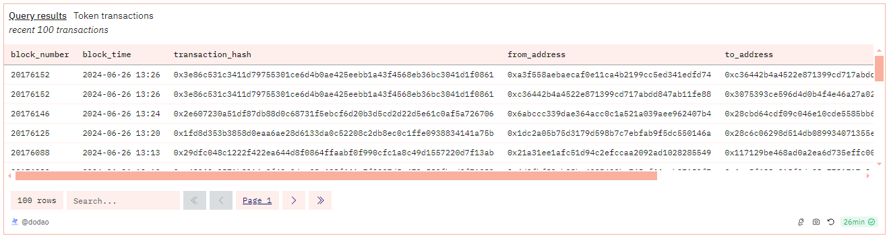
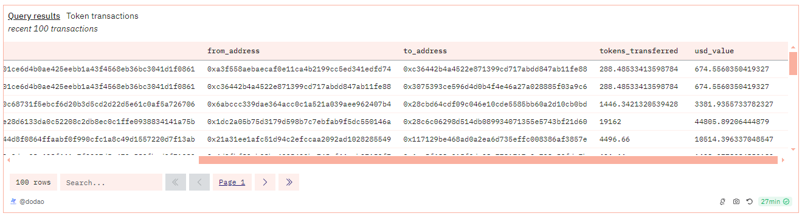

# About

The table shows the given token's most recent 100 transactions. It includes the standardized value of tokens transferred and their USD value.

# Graph




# Relevance

This query is relevant for analyzing the transaction history of a given token. By providing the standardized value of tokens transferred and their corresponding USD value, it offers insights into the volume and value of token transactions over the recent time. It also shows behavior of the token holders such as the frequency and size of transfers.

# Query Explanation

The query first finds the price and decimals of the token for USD value calculation and then get the transactional history of the token and standardize the value of tokens involved in the transaction.

Price CTE calculates the average USD price of the specified token and retrieves its decimals.

```sql
price AS (
    SELECT
      erc.decimals,
      erc.contract_address,
      AVG(dex.token_price_usd) as price
    FROM
      dex.prices_latest dex
      JOIN tokens.erc20 erc ON dex.token_address = erc.contract_address
    WHERE
      erc.contract_address = {{token_address}}
      AND dex.token_address = {{token_address}}
      AND erc.blockchain = '{{chain}}'
    GROUP BY
      erc.decimals,
      erc.contract_address
  )
```

Transaction CTE retrieves the latest 100 transactions for the specified token. It calculates the standardized value of tokens transferred by adjusting for the token's decimals and computes the USD value of each transaction using the average DEX price.

```sql
transactions AS (
    SELECT
      evt.evt_block_number AS block_number,
      evt.evt_block_time AS block_time,
      evt.evt_tx_hash AS transaction_hash,
      CAST(evt."from" AS VARCHAR) AS from_address,
      CAST(evt."to" AS VARCHAR) AS to_address,
      (evt.value / POWER(10, p.decimals)) AS tokens_transferred,
      (evt.value * p.price / POWER(10, p.decimals)) AS usd_value
    FROM
      erc20_{{chain}}.evt_Transfer evt
      JOIN price p ON evt.contract_address = p.contract_address
    WHERE
      evt.contract_address = {{token_address}}
    ORDER BY
      block_time DESC
    LIMIT
      100
  )
```

Finally selects everything from the Transaction CTE.

```sql
SELECT
  *
FROM
  transactions
```

**Hardcoded addresses**

## Tables used

- dex.prices_latest (Curated dataset contains token addresses and their USD price. Made by @bernat. Present in the spellbook of dune analytics [Spellbook-Dex-PricesLatest](https://github.com/duneanalytics/spellbook/blob/main/models/dex/dex_prices_latest.sql))
- tokens.erc20 (Curated dataset for erc20 tokens with addresses, symbols and decimals. Origin unknown)
- erc20\_{{Blockchain}}.evt_Transfer (Curated dataset of erc20 tokens' transactions. Origin unknown)

## Alternative Choices
