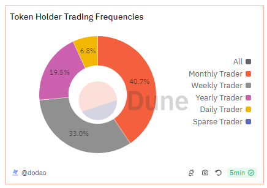

# About

The graph shows an analysis of the trading activities and categorizes traders of the given token based on their trading frequency and overall activity percentage.

# Graph



# Relevance

- Market Liquidity and Trading Behavior: Analyzing trade volumes and frequencies helps in understanding the liquidity of the token and the behavior of its traders. High trade volumes indicate a healthy trading environment with active participation, which can attract further investments.
- Holder Confidence and Sentiment: Tracking how actively holders trade can provide insights into holder confidence and market sentiment. For instance, a high frequency of large trades might indicate negative sentiment towards the token and its condition in the market, while the accumulation of tokens without selling might suggest long-term confidence in the token's value.

# Query Explanation

This query calculates distribution of token holders and their trading frequencies for the given token on the given blockchain. It categorizes addresses based on their trading activity size labels, giving insight into the token's distribution by holding percentage and trading activity.

Token balance CTE calculates the net amount of tokens each address holds by considering both token transfers out (sold) and transfers in (bought).

```sql
token_balances as (
    select -- tokens sold
      - sum(cast(value as double) / pow(10, b.decimals)) as amount,
      "from" as address
    from
      erc20_{{chain}}.evt_Transfer a
      join tokens.erc20 b on a.contract_address = b.contract_address
    where
      a.contract_address = {{token_address}}
    group by
      2
    union all
    select -- tokens bought
      sum(cast(value as double) / pow(10, b.decimals)) as amount,
      a.to as address
    from
      erc20_{{chain}}.evt_Transfer a
      join tokens.erc20 b on a.contract_address = b.contract_address
    where
      a.contract_address = {{token_address}}
    group by
      2
  )
```

Token holders CTE aggregates the net token balances calculated in the Token Balance CTE for each address.
It sums up the amounts for each address to get the total balance.

```sql
token_holders as (
    select
      address,
      sum(amount) as balance
    from
      token_balances
    group by
      1
  )
```

Token Trades CTE fetches trade details where the given token is either bought or sold. Then it unions the similar trade data from `cow_protocol_ethereum.trades` table

```sql
token_trades as (
    select
      t.tx_from,
      t.token_bought_address,
      t.token_sold_address,
      t.amount_usd,
      case
        when t.token_bought_address = {{token_address}} then t.token_bought_amount
        else 0
      end as token_bought_amount,
      case
        when t.token_sold_address = {{token_address}} then t.token_sold_amount
        else 0
      end as token_sold_amount,
      t.block_time,
      h.balance
    from
      dex.trades t
      inner join token_holders h on t.tx_from = h.address
    where
      (
        t.token_sold_address = {{token_address}}
        or t.token_bought_address = {{token_address}}
      )
    union all
    select -- adding cowswap agg trades for now; needs to use dex_aggregator in the future
      c.trader as tx_from,
      c.buy_token_address as token_bought_address,
      c.sell_token_address as token_sold_address,
      c.usd_value as amount_usd,
      case
        when c.buy_token_address = {{token_address}} then c.units_bought
        else 0
      end as token_bought_amount,
      case
        when c.sell_token_address = {{token_address}} then c.units_sold
        else 0
      end as token_sold_amount,
      c.block_time,
      h.balance
    from
      cow_protocol_ethereum.trades c
      inner join token_holders h on c.trader = h.address
    where
      (
        c.sell_token_address = {{token_address}}
        or c.buy_token_address = {{token_address}}
      )
  )
```

Token Trading Volume CTE calculates the maximum balance for each address involved in trades where the given token was bought or sold. It groups by the address to get the highest recorded balance for each trader.

```sql
token_trading_volumes as (
    select
      tx_from,
      max(balance) as balance
    from
      token_trades
    where
      token_bought_address = {{token_address}}
    group by
      1
    union all
    select
      tx_from,
      max(balance) as balance
    from
      token_trades
    where
      token_bought_address <> {{token_address}}
    group by
      1
  )
```

Dex labels trader frequencies CTE retrieves label information for addresses that traded the token, specifically those labeled with trading frequencies. It filters labels from the labels.all table based on specific conditions (category = 'dex', label_type = 'usage', model_name = 'trader_frequencies'). It partitions and orders the rows to get unique entries for each address, retaining the latest label by using ROW_NUMBER().

```sql
dex_labels_trader_frequencies as (
    select
      address,
      model_name,
      name
    from
      (
        select
          category,
          label_type,
          model_name,
          name,
          blockchain,
          address,
          row_number() over (
            partition by
              category,
              label_type,
              model_name
            order by
              name desc
          ) as rn
        from
          labels.all
        WHERE
          name is not null
          AND address in (
            select
              tx_from
            from
              token_trading_volumes
          )
          and category = 'dex'
          and label_type = 'usage'
          and (model_name = 'trader_frequencies')
      )
  )
```

Finally the select statement groups the trader frequency labels (name), counting the number of occurrences of each label. It provides a distribution of addresses based on their trading frequency size labels.

```sql
select
  name as size,
  count(*) as count_size
from
  dex_labels_trader_frequencies
group by
  name
```

## Tables used

- tokens.erc20 (Curated dataset for erc20 tokens with addresses, symbols and decimals. Origin unknown)
- erc20\_{{Blockchain}}.evt_Transfer (Curated dataset of erc20 tokens' transactions. Origin unknown)
- labels.funds (Curated dataset contains labels of known funds addresses across chains. Made by @soispoke. Present in the spellbook of dune analytics [Spellbook-Labels-Funds](https://github.com/duneanalytics/spellbook/blob/main/models/labels/addresses/institution/identifier/funds/labels_funds.sql))
- dex.trades (Curated dataset contains DEX trade info like taker and maker. Present in spellbook of dune analytics [Spellbook-Dex-Trades](https://github.com/duneanalytics/spellbook/blob/main/models/_sector/dex/trades/dex_trades.sql))
- cow_protocol_ethereum.trades (Curated dataset contains contract address with sell and buy token addresses alongwith number of units sold and bought, their price and usd equivalent. Present in spellbook of dune analytics [Spellbook-Cow-Protocol](https://github.com/duneanalytics/spellbook/blob/main/models/cow_protocol/ethereum/cow_protocol_ethereum_trades.sql))
- labels.all (Curated dataset contains labels of known addresses across chains including funds, exchanges, safes, contracts, ens, coins, bridges, dao, pools, etc. Origin unknown)

## Alternative Choices
